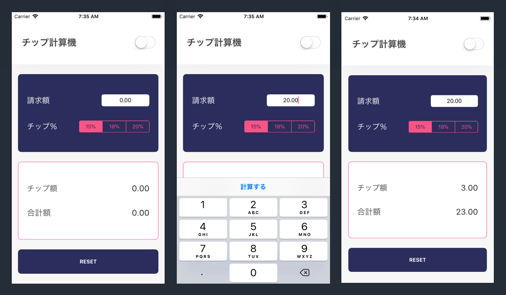

これは、Make SchoolのiOSアプリチュートリアルシリーズのうちの第二弾のチュートリアルです。このチュートリアルでは、チップ計算機を開発することで、UIレイアウトを作成するための核となるコンセプトについて学びます。

## チップ計算機の理由?

アメリカ合衆国には、バーテンダーやウェイターなど、接客スタッフにチップを出す習慣があります。チップは心付けとしても知られていますが、請求金額合計15%から20％が一般的な範囲です。

頭の中で計算をする代わりに、シンプルなチップ計算機を開発して、チップを計算してもらいましょう。

# これは誰のためのものですか?

Xcodeのナビゲーションおよび使用方法について基本的な理解のあるiOS初心者。このチュートリアルは_インターフェイスビルダー_を使って、中級レベルのUI開発に焦点を当てます。

## 既に知っているべきこと

このチュートリアルは最初のMake Schoolチュートリアルの _Magic 8-Ball_ 開発で学んだ主なコンセプトの上に成り立っています。あなたは、すでにシンプルなiOSアプリの開発方法や、Xcodeの操作方法について基本的な理解を持っているはずです。

もしあなたがまったくの初心者で、iOS開発の初歩的な入門を求めている場合は、 _Magic 8-Ball_ 開発に関する前回のMake Schoolチュートリアルをまず完了することをオススメします。

## 推定完了時刻：

3 時間

# 私たちが作っているもの

このチュートリアルが終わる頃には、あなたのチップ計算機が完成します！

チップ計算機は以下を行うことができます：

1. チップを計算するためのベース請求金額を入力します。
2. チップの割合を15%、18%、20%から選択します。
3. チップ金額および請求書総額を計算します。
4. ライトモードとダークモードの間でテーマをトグルします。
5. チップ計算機を取り消し、リセットします。

# 学習する内容

このチュートリアルが終わるまでに、以下ができるようになります：

- デザインを視覚的にUIコンポーネントへ分解する
- 一般的なUIKitオブジェクトについて学ぶ
- Auto-layoutおよびびスタックビューを使って、ダイナミックにリサイズするレイアウトを作成する
- UIオブジェクトのプロパティをプログラムで設定する

# 行き詰まった場合は

コーディング（そしてデバッギング）の最中に行き詰まってしまうのは、プログラミングのプロセスにおいてごく自然なことです。何か問題に悩んだり、迷ってしまったら、少し休んで一息つきましょう。散歩をするのもいいかもしれません。その後で、今までの足取りを見直してみましょう（散歩ではなくチュートリアルです）。チュートリアルの各ステップに従ったことを確認してください。タイピングミスをしたり、うっかりと重要な手順を飛ばしてしまうことはよくあります。

あなたのコードと解答を比べたい場合は、ここで解答を参照することができます。

TODO: GitHubのレポのリンクを挿入する
