Xcodeに取りかかる前に、まずはチップ計算機のデザインを検討して分解する時間を取ります。デザインを、少しずつコードが書ける、視覚的に小さなかたまりに分解する方法を学びましょう。

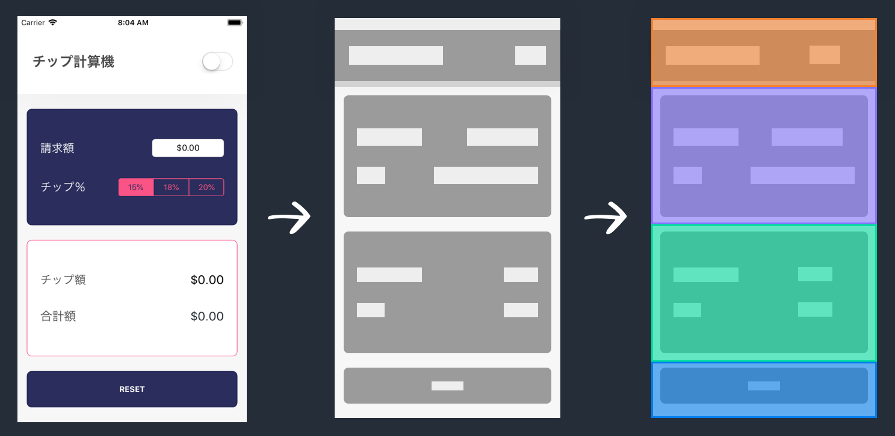

> [info]
このチュートリアルでは、 _UI_ （ユーザーインターフェース）やビューという用語をよく使います。どちらの用語も、アプリのユーザーインターフェース、またはユーザーが交流する画面上の視覚的な要素を指しています。

# デザインをレビュー

これから開発するチップ計算機のデザインをもう一度見てみましょう：

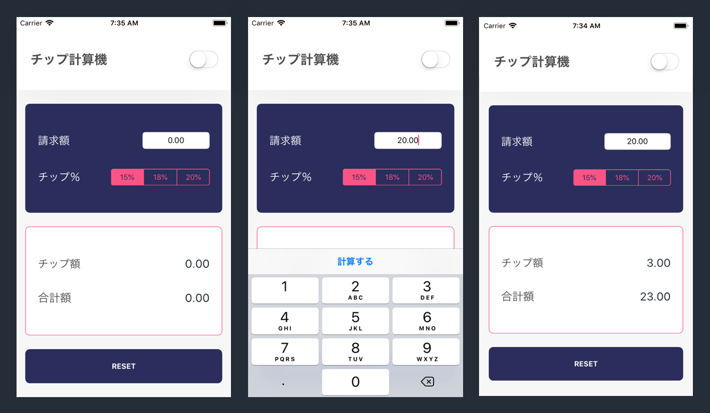

以上の各画面に関する手順を掲載しています（左から右）：

1. ユーザーが初めてアプリを開くか、リセットボタンをタップした時の空の状態。
2. ユーザーは、iOSキーボードを利用して請求額を請求額フィールドに入力します。
3. _Calculate_ ボタンを押した後、 またはチップの割合を選択した後に、キーボードを非表示にし、チップの額と請求書総額を表示します。

ユーザーはまた、右上隅のスイッチを使って、ライトモードからダークモードへとアプリの色のテーマをトグルすることもできます。ダークモードでは、チップ計算機は次のように表示されます：

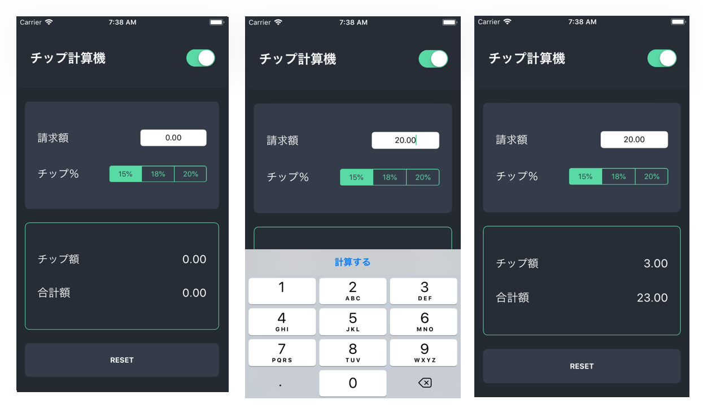

私たちのアプリのデザインを検討しました。次に、デザインを視覚的に小さな要素へ分解する方法を学びましょう。

# デザインの分析

計画なしでアプリのデザインを実装しようとすると、途方に暮れてしまうかもしれません。どこから始めたらいいかというのは、知るのが困難です。

代わりに、デザインの要素を、少しずつ実装できる小さなグループへと視覚的に分解していきましょう。

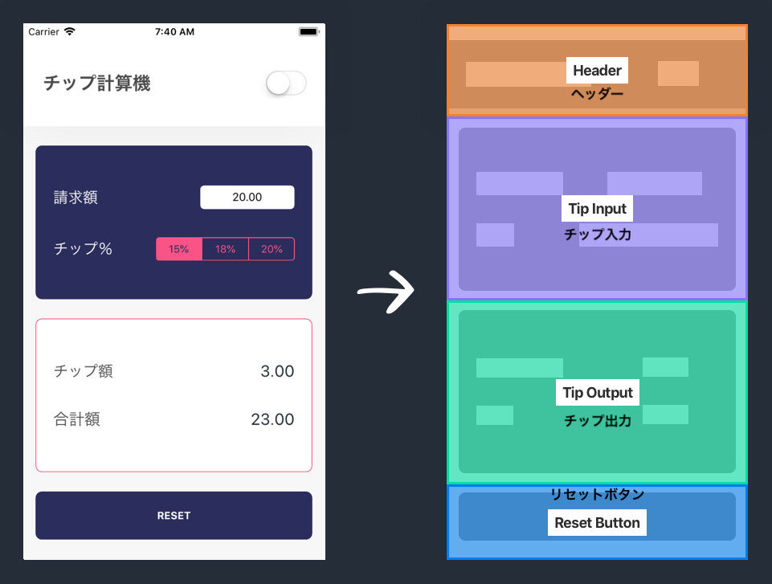

自分一人でこのプロセスに取り組む場合は、ペンと紙を使うと便利です。

この時点で、「なぜああいう方法で各UI要素をグループ化したのだろう？」と思っているかもしれませんね。次のような他の選択肢ではダメなのでしょうか？

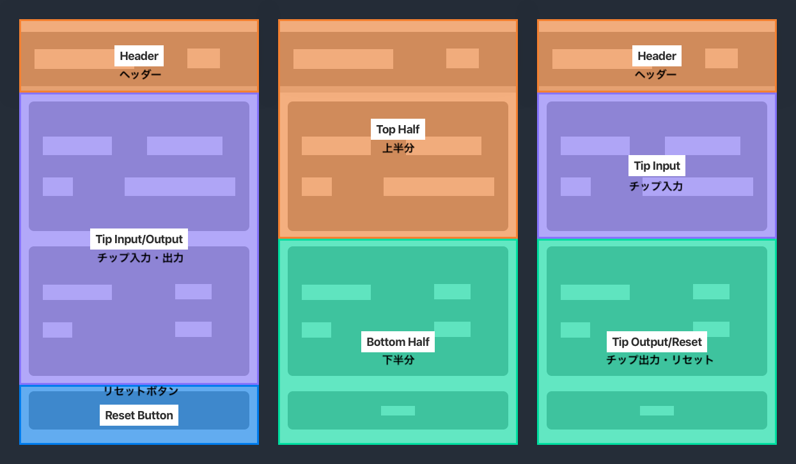

この質問に答えるには、UIの基本的な構成要素である、_UIView_ について学ぶ必要があります。

## UIViewとは何ですか？

_UIView_ クラスは、iPhone画面上の長方形の領域を表すオブジェクトです。UI全体は（例外は多少あれど）、複数の _UIView_ オブジェクトから構築されています。

<<<<<<< HEAD
この点の理解を深めるため、金銭の送受信をするアプリ、Square Cashを検討してみましょう。
=======
To better understand this, let's take a look at Square Cash, an app that allows you to send and receive money.
>>>>>>> cbcfbeaf301c91d7970277fdcd0642ed9be265c9

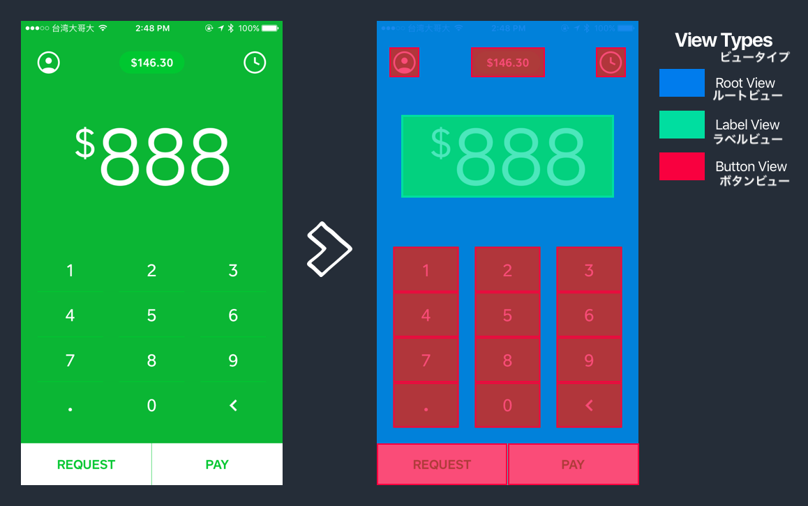

ご覧の通り画面全体に、ルートビューという名前を付けた、ベースの`UIView`（青）があります。これは通常、有効な各`UIViewController`のルートビューになります。

ルートの上にサブビューを追加することができます。これらのサブビューは`UIView`オブジェクトまたは`UIView`サブクラスです。 _Square Cash_ アプリの場合、UIはボタンとラベルから構成されていますが、`UIKit`が提供する他の種類のUIオブジェクトも多くあります。

> [info]
**UIKitとは何か**
>
<<<<<<< HEAD
`UIKit`は、あらかじめ開発されたオブジェクトと、iOSアプリの開発に使用できる機能を提供するフレームワークです。これには、たくさんの内蔵機能（アプリのライフサイクルやリソース管理を取り扱う）や、一般的に使用されるUIコンポーネント（ボタンやラベル）が含まれています。
=======
`UIKit` is a framework that provides pre-built objects and functionality that you can use to build iOS apps. This includes a lot of under-the-hood functionality (handling your app's lifecycle and resource management) as well as commonly used UI components (buttons and labels).
>>>>>>> cbcfbeaf301c91d7970277fdcd0642ed9be265c9

<!-- break -->

> [challenge]
各`UIView`オブジェクトをチップ計算機のデザイン内で特定しましょう。以下のデザインを参照することができます：
>
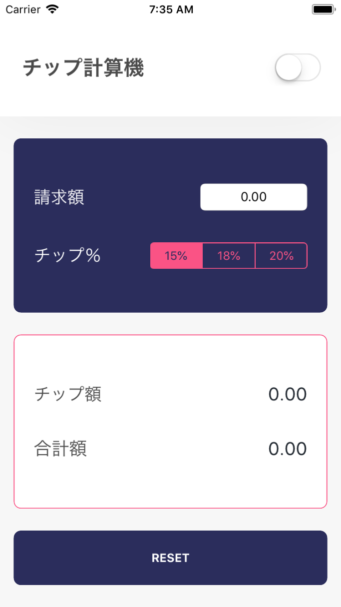

<!-- break -->

> [solution]
チップ計算機のデザインを個々のサブビューに分解すると、次のようになるはずです：
>
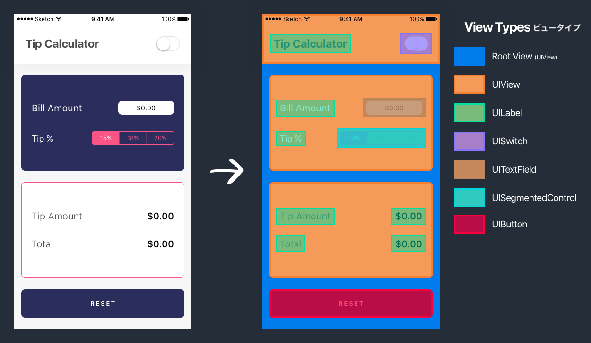
>
UIKitから使っている新しいUIコンポーネントが数多くあることに気づくでしょう。これらの各UIオブジェクトは、`UIView`か、またはこれから継承されたものです。これらのUIオブジェクトそれぞれについて、チュートリアルの後半で正式に紹介します。

## サブビューのグループ化

<<<<<<< HEAD
サブビューをグループで整理するのはよくあることです。厳密にはサブビューを好きなようにグループ化できるのですが、一般的にグループは、UIの配置とレイアウトの計画方法に基づきます（これに関しては後ほど扱います）。
=======
It's common to organize our subviews in groups. Although you can technically group subviews however you'd like, usually groups are based on how you plan to position and layout your UI (more on this later).
>>>>>>> cbcfbeaf301c91d7970277fdcd0642ed9be265c9

_Square Cash_ の実例を使って、 以下の方法で各サブビューをグループ化することができます：

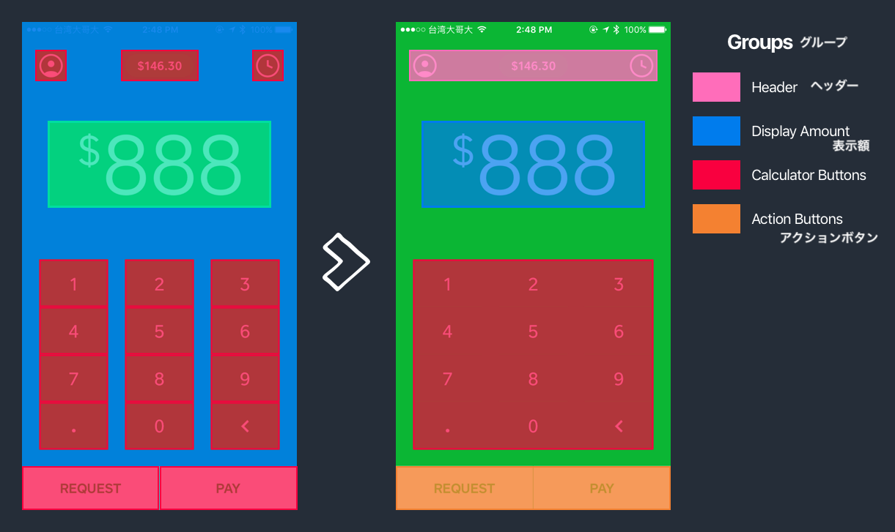

これは、ビューのグループ全体の再配置を簡単にします。例えば、ヘッダー全体を数ピクセル単位で上下に再配置するなどです。

_Square Cash_ アプリで踏んだ手順を、チップ計算機に適用しましょう。

> [challenge]


前回の課題で終了した部分を使って、ビューの各要素をグループ化しましょう。終わったら、あなたの答えと解答を確認しましょう。以下のデザインを参照することができます：
>


<!-- break  -->

> [solution]
前回の課題の個々のビューオブジェクトは、次のようにグループ化されているはずです：
>
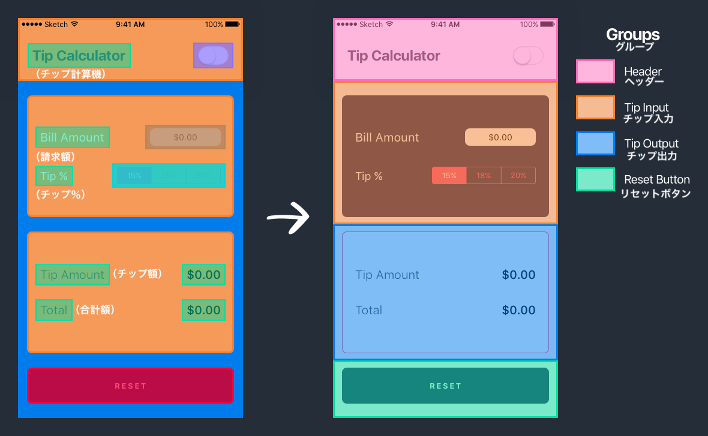

<!-- TODO: better explanation of how we grouped these elements together -->

# UIKitからUIオブジェクトの導入

前のセクションでは、各UIViewオブジェクトを特定し、4つの大きなグループへとグループ化しました：

1. ヘッダー - アプリのタイトルとテーマのスイッチを表示します
1. チップ入力 - ユーザー入力のためのUI要素を提示します
1. チップ出力 - チップ計算機の出力を表示します
1. リセットボタン - 最初の状態に計算機をリセットします

次に、UIKitから使用するすべてのUIコンポーネントを一つずつ紹介していきましょう。これらのUIオブジェクトは、あなたのアプリのUIを作成する基本的な構成要素となるために設計されています。

## ヘッダー

ヘッダーは、ビューコントローラーのルートビュー上のカスタムビューです。

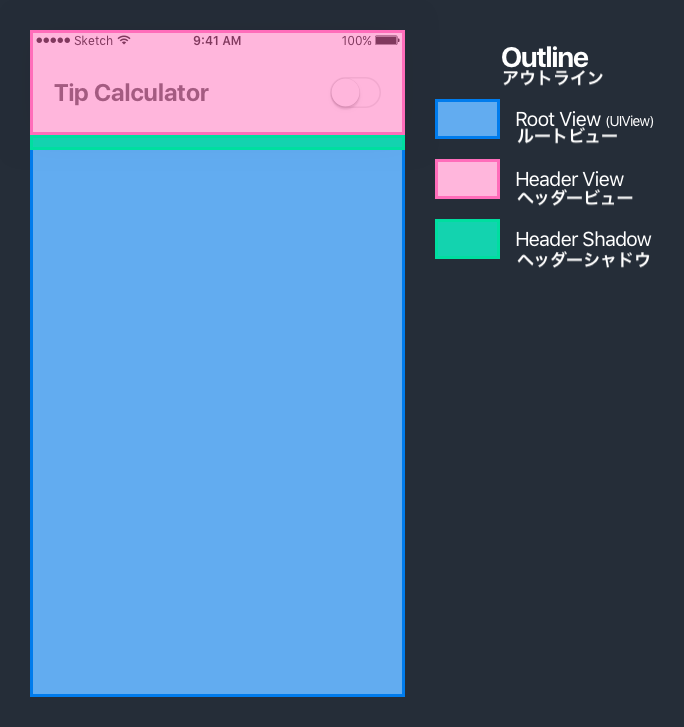

ご覧の通り、ヘッダーはルートビューの一番上に置かれた`UIView`です。さらに、ヘッダービューそのものの上に、2つのサブビューがあります。ラベルとスイッチです。

### UILabel

`UILabel`は、iOSデバイスの画面上でテキストを表示するのに使われます。


<<<<<<< HEAD
`UILabel`クラスには、多くのプロパティがあります（テキスト、フォント、テキストカラー、行数など）。
=======
The `UILabel` class can be configured from it's many properties. (i.e. text, font, text color, number of lines, etc).
>>>>>>> cbcfbeaf301c91d7970277fdcd0642ed9be265c9

<!-- In our case, we'll use an off-black (#4A4A4A) text color and bold font weight of `San Francisco`, the default system font created by Apple. -->

ここでは、このラベルを使用してチップ計算機アプリのタイトルテキストを表示します。

### UISwitch

`UISwitch`オブジェクトは`UIControl`のサブクラスで、このサブクラスは`UIView`のサブクラスです。

```
class UISwitch : UIControl, NSCoding { ... }

class UIControl : UIView { ... }
```

`UIKit`から使用するすべての UI オブジェクトは、`UIView`クラスから継承されます。

スイッチは、オンとオフの状態の間をトグルするためのデフォルトのUIコンポーネントです。これは、照明のスイッチのiOS版だと考えるといいでしょう。


オンにトグルされると、スイッチはアプリのテーマの色を明るい色から暗い色に変更します。


## チップの入力

次のビューのグループにより、ユーザーは請求額と請求書に対するチップの割合を計算するための数値を入力できるようになります。

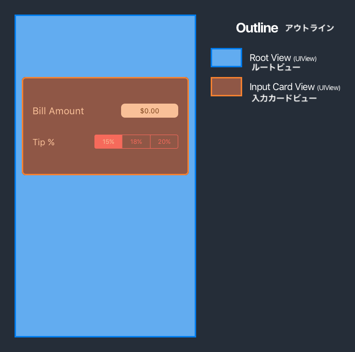

<<<<<<< HEAD
ヘッダービューと同じく、このUIコンポーネントのグループを個々のコンポーネントへと分解します。
=======
As with the header view, we'll break down this group of UI components into its individual components.
>>>>>>> cbcfbeaf301c91d7970277fdcd0642ed9be265c9

### UILabel

すでに`UILabel`クラスは紹介したので、もう一度繰り返すことはしません。

> [challenge]
チップ入力カードビューで、UILabelオブジェクトはどこにありますか。

<!-- break -->

> [solution]
ラベルは両方とも、チップ入力カードビューの左側にあります： 

### UITextField

`UITextField`は、ユーザーがiOSのキーボードを使ってテキストを入力できるテキストフィールドを提供します。

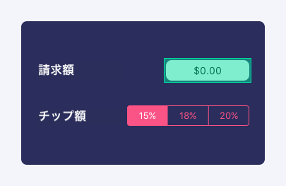

ユーザーがテキストフィールドをタップすると、テキストフィールドはアクティブになり（最初の反応として参照されます）、デバイスのキーボードが表示されます。

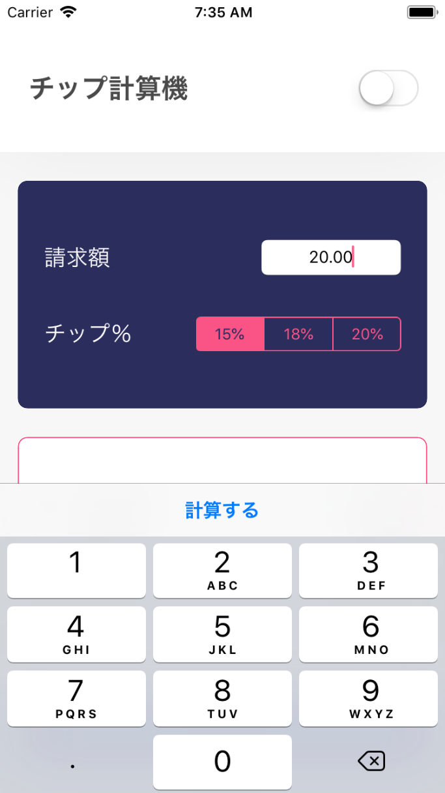

ユーザーが請求金額を入力するテキストフィールドが必要になります。

### UISegmentedControl

<<<<<<< HEAD
`UISegmentedControl`クラスはスイッチと似ていて、ユーザーが異なるオプション間でトグルできるようにするUIオブジェクトを提供しています。 主な違いは、セグメント化されたコントロールは2つ以上の異なるステートを有することができる一方で、スイッチはオンとオフのステート間でトグルできるだけだということです。
=======
Similar to the switch, the `UISegmentedControl` class provides a UI object that allows the user to toggle between different options. The main different being that a segmented control can have 2+ different states, while a switch can only toggle in-between an on and off state.
>>>>>>> cbcfbeaf301c91d7970277fdcd0642ed9be265c9

2つ以上のトグルのステートに加えて、スイッチは各オプション名にラベル付けできます。チップ計算機で使用する、セグメント化されたコントロールを見てみましょう。

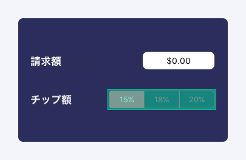

チップ計算機にはセグメント化されたコントロールが必要になります。これは、チップの計算に使いたい割合をユーザーが選択できるようにするためです。

## チップの出力

チップ出力グループは、チップ計算機の出力チップとして、請求総額を提示します。

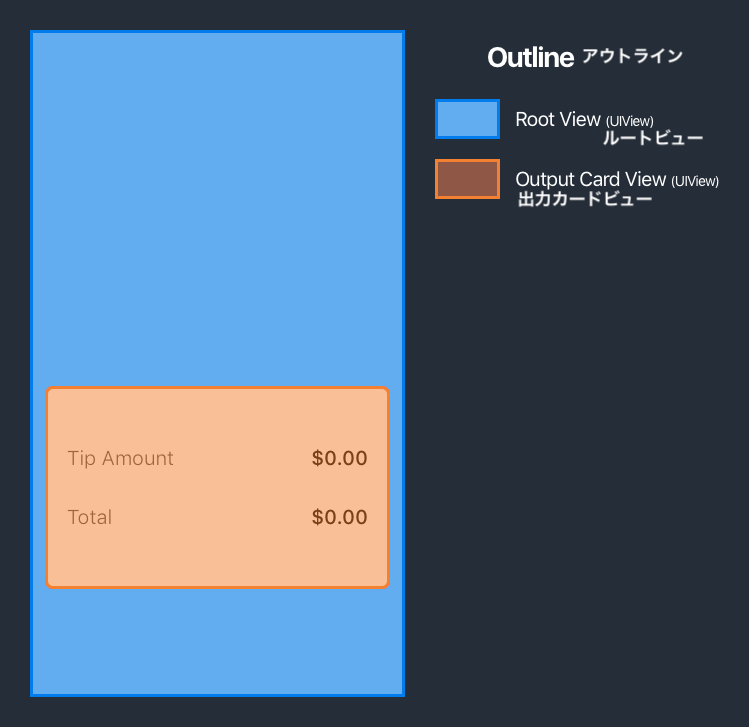

これで、このグループのUIオブジェクトをすべて紹介しました。

> [challenge]
チップ出力グループの異なるUIKitオブジェクトすべてを探してください。

<!-- break -->

> [solution]
チップ出力グループ全体は`UIView`のカードビューによって構成されており、これには各タイトルと金額の`UILabel`が4つ含まれています。
>
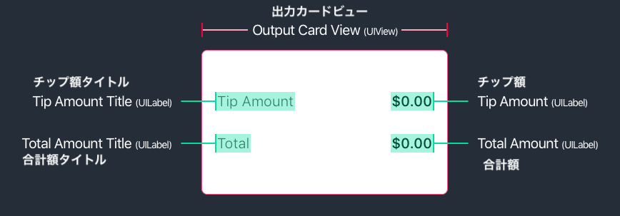

## リセットボタン

次に、チップ計算機に必要な最後のUIKitオブジェクト`UIButton`を紹介します。

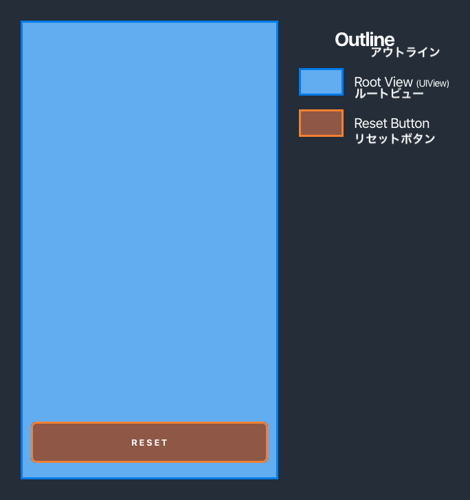

このグループ化は非常に簡単で、含まれている唯一の構成要素はボタンだけです。

### UIButton

<<<<<<< HEAD
`UIButton`は、ラベルと同じく、UIを作成するのに最もよく使われるオブジェクトです。ユーザーはタップすることで、イベントを引き起こし、ボタンとやりとりすることができます。このイベントは、関数の呼び出しとコードの実行につなげることができます。

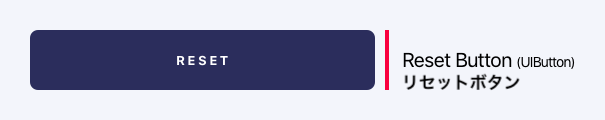

リセットボタンによって、ユーザーはチップ計算機から現在の入力内容を消して、空の状態にリセットできます。
=======
The `UIButton`, along with labels, is one of the most common objects for building your UI. A user can interact with a button by tapping it and triggering an event. This event can be tied to calling a function and running code.


Our reset button will allow a user to clear the current input from our tip calculator and reset it to an empty state.
>>>>>>> cbcfbeaf301c91d7970277fdcd0642ed9be265c9

> [info]
たった今習ったばかりのUIKitオブジェクトについて、すべて暗記する必要はありません。UI開発に使える既成のUIコンポーネントがあることを覚えておきましょう。どんな種類のビジュアル要素を構築するのであれ、土台として使えるベースUIオブジェクトがあるかどうか、`UIKit`を確認してみましょう。

# 学習内容をおさらい

<<<<<<< HEAD
`UIKit`の多くの新しいUIオブジェクトについて検討し、学んできました。これらのオブジェクトを、アプリの様々なUIを作成するための構成要素として使用します。UIKitオブジェクト全部を紹介する包括的なガイドを探すのであれば、Appleの開発者向け文書を参照することができます。[こちらをクリックしてください（英語)](https://developer.apple.com/documentation/uikit/views_and_controls)。
=======
We've reviewed and learned about many new UI objects in `UIKit`. You'll use these objects as basic building blocks for creating various UI for your app. If you're ever looking for a comprehensive guide of all of the UIKit objects, you can reference Apple's developer docs by [clicking here](https://developer.apple.com/documentation/uikit/views_and_controls).
>>>>>>> cbcfbeaf301c91d7970277fdcd0642ed9be265c9

もっと先へ進んで、Xcodeでチップ計算機の開発を始めて、これらのUIコンポーネントのそれぞれの使い方を検討していきます。
