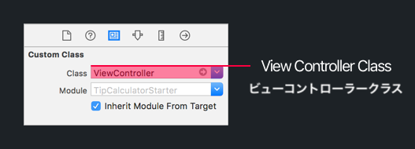
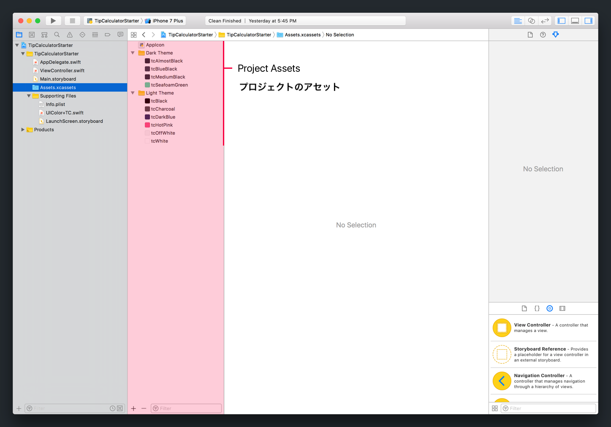

このセクションでは、新たなXcodeプロジェクトに出会い、チップ計算機のデザインを実装する作業を始めます。

Xcodeのスタータープロジェクトをダウンロードすることから始めましょう。`zip`ファイルをダウンロードできます [こちらをクリックしてください。](https://github.com/ocwang/TipCalculatorStarter/archive/master.zip)

# スタータープロジェクト

スタータープロジェクトをダウンロードしたら、このプロジェクトをXcodeで開いてください。次のように表示されるはずです：


最新のスタータープロジェクトをシミュレーターまたはiPhoneデバイスでビルドし、実行してください。

> [action]
コンパイルエラーがないことを確認するために、新しいスタータープロジェクトを実行してください。すべてうまく行くと、プロジェクトの実行に成功し、空っぽで真っ白の画面が表示されるはずです。（まだ何も作っていませんからね！）
>


次にスタータープロジェクトの中味を見てみましょう。

## ビューコントローラー

<!-- TODO: considering adding a section about directory layout? -->

まずはビューコントローラーから始めます。

> [action]
プロジェクトナビゲーターを使って、`ViewController.swift`ソースファイルを開いてください。次のコードが表示されるはずです：
>
```
class ViewController: UIViewController {
>
    // MARK: - ライフサイクルを見る
>
    override func viewDidLoad() {
        super.viewDidLoad()
    }
}
```

これは単なる定型文で、まだ何も起こっていません。やがてはここにチップ計算機のロジックを書くことになります。

## 主要なストーリーボード

Storyboardへと移動しましょう。

> [action]
プロジェクトナビゲーターから、`Main.storyboard`を開いてください。次の内容が表示されます：
>


今のところ、ビューコントローラーは空っぽで真っ白です。（シミュレーターで表示されたのを覚えていますか？）

Storyboardビューコントローラーがいかに`.swift`ファイルに接続されているかを見直しましょう。

> [action]
Storyboard内のビューコントローラーの表示をクリックしてください。ストーリーボードのビューコントローラーが選択された状態で、ユーティリティエリアのクラスインスペクターへ移動します。
>
`ViewController.swift`ソースコードは、`Main.storyboard`のビューコントローラーオブジェクトとペアになっていることに気づくでしょう。
>


次に、プロジェクトのアセットについて検討してみましょう。

## XCAssets

プロジェクトのアセットには、画像、動画、アプリアイコンなど、各種メディアが含まれています。

> [action]
プロジェクトアセットを参照するには`Assets.xcassets`を開いてください。

アセットのカタログには、すでに設定されているアプリのアイコンと、後で実装する別のカラーテーマ用にあらかじめ定義された色のセットを含んだ2つのフォルダがあるはずです。

アセットのカタログでカスタムカラーのペアを作るため、プロジェクトには、コードを通じてアプリの各色にアクセスできるようにしてくれる`UIColor`の拡張子が含まれています。

> [action]
プロジェクトナビゲーターから`UIColor+TC.swift`を開いてください。これが見当たらない場合は、 プロジェクトナビゲーターで`Supporting Files`フォルダを拡張する必要があります。次のように表示されます。
>
```
import UIKit.UIColor
>
extension UIColor {
>
    // MARK: テーマの色
>
    static var tcDarkBlue: UIColor {
        return UIColor(named: "tcDarkBlue")!
    }
>
    static var tcOffWhite: UIColor {
        return UIColor(named: "tcOffWhite")!
    }
>
    static var tcHotPink: UIColor {
        return UIColor(named: "tcHotPink")!
    }
>
    static var tcCharcoal: UIColor {
        return UIColor(named: "tcCharcoal")!
    }
>
    static var tcAlmostBlack: UIColor {
        return UIColor(named: "tcAlmostBlack")!
    }
>
    static var tcMediumBlack: UIColor {
        return UIColor(named: "tcMediumBlack")!
    }
>
    static var tcBlueBlack: UIColor {
        return UIColor(named: "tcBlueBlack")!
    }
>
    static var tcSeafoamGreen: UIColor {
        return UIColor(named: "tcSeafoamGreen")!
    }
>
    static var tcBlack: UIColor {
        return UIColor(named: "tcBlack")!
    }
>
    static var tcWhite: UIColor {
        return UIColor(named: "tcWhite")!
    }
}
```

このファイルは、各クラス変数と、アセットカタログで定義されたカスタムカラーのセットとをペアにします。

コーディングを開始すると、`UIColor`クラスの変数を通じて、各色にアクセスできるようになります：

```
let selectedColor = UIColor.tcSeafoamGreen
```

カスタムカラーのそれぞれに接頭辞`tc`をつけることによって、ネームスペースの衝突を回避し、Xcodeのオートコンプリートで簡単に色を探せるようにします。

> [info]
このプロジェクトでは、あなたのカスタムカラーはアセットカタログ内で定義されていますが、これはカスタムカラーを定義する数多くの方法のたった一つにすぎません。カスタムカラーの作成は、プログラムによって、またはインターフェースビルダーを通じて実施できます。

## アプリの委託

新たなプロジェクトのツアーを終えるため、ちょっと _App Delegate_ を見てみましょう。

> [action]
プロジェクトナビゲーターから`AppDelegate.swift`を開きます：
>
```
import UIKit
>
@UIApplicationMain
class AppDelegate: UIResponder, UIApplicationDelegate {
>
    var window: UIWindow?
>
    // MARK: - アプリのライフサイクル
>
    func application(_ application: UIApplication, didFinishLaunchingWithOptions launchOptions: [UIApplicationLaunchOptionsKey: Any]?) -> Bool {
        // アプリケーションの起動後にカスタマイズするためポイントをオーバーライドします。
        return true
    }
}
```

<!-- break -->

> [info]
このチュートリアルでは、 _App Delegate_ を変更したり修正したりする必要はありません。その一方で、自分のアプリを書き始めるときのために、目的を理解していると役に立ちます。

各iOS Xcodeプロジェクトには、アプリのライフサイクルに関する責任を負う`AppDelegate.swift`ファイルが欠かせません。App Delegateは、アプリのライフサイクルイベントがトリガーされたときに何が起こるかを指定します。よくあるイベントの例は、アプリの立ち上げ、プッシュ通知の受信、アプリの終了などです。

チップ計算機のApp Delegateでは、各Xcodeのプロジェクトテンプレートにデフォルトとしてついてくる常用文の`application(_:didFinishLaunchingWithOptions:)`のメソッド以外のコードは追加しません。

## まとめ

先ほど、新しいXcodeスタータープロジェクトのファイルを参照したばかりです。このチュートリアルでは、最終的なチップ計算機を完成させるため、このプロジェクトの開発を続けていきましょう。

まずはStoryboardから始めて、UI用にビューを作成していきましょう。
