_インターフェイスビルダー_ でUIを実装することで、アプリの開発を始めます。参考までに、以下はチップ計算機のデザインです：

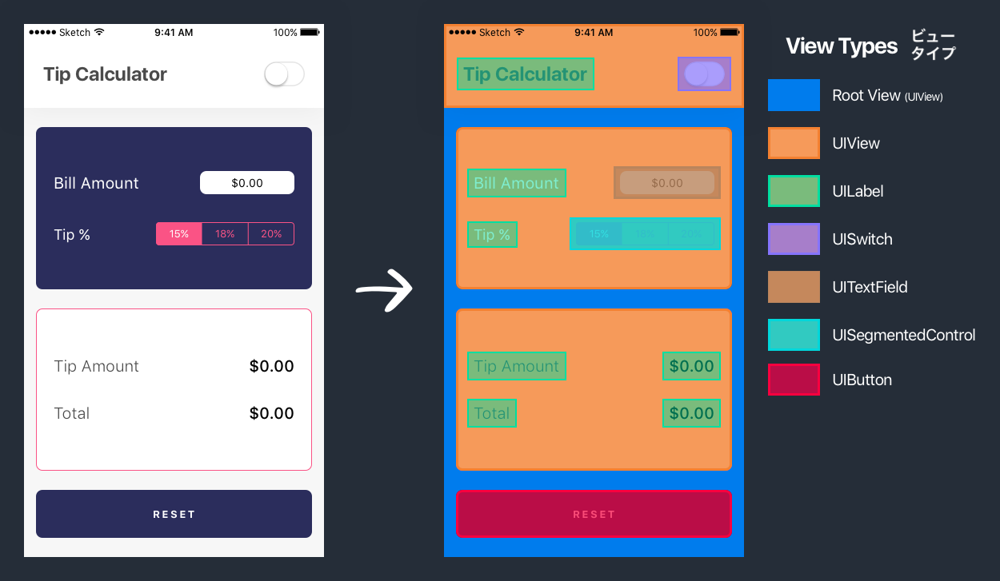

# ビューを作成

まずは、ヘッダービューを`UIView`で作成することから始めます。

> [info]
`UIKit`には`UINavigationBar`と呼ばれる、ヘッダーバーに似た独自のバーがあります。シンプルに作業できるようにするため、iOSの`UINavigationBar`を使用する代わりに、イチから独自のヘッダービューを作成します。

<!-- break -->

> [action]
プロジェクトナビゲーターから`Main.storyboard`を開いてください。シングルビューコントローラーが表示されるはずです。

次に、`UIView`を追加し、これがヘッダービューになるように位置とサイズを変更します。

> [action]
`UIView`オブジェクトをオブジェクトライブラリーからビューコントローラーのトップへとドラッグしてヘッダービューを作成してください。今のところは、完璧なサイズや位置については、あまり悩まないでください。これは後で取り扱います。
>

たった今追加した新しい`UIView`オブジェクトが、カスタムヘッダービューになります ここには後で他のサブビューを追加します。

ヘッダービューの色がビューコントローラーのルートビューと同じ白色なので、少し見づらいと思いませんか。ルートビューの色を変更して、コントラストを与えましょう。

> [action]
ビューコントローラーのルートビューをオフホワイトに変更しましょう：
>
1. Storyboardの中でクリックするか、Document Outlineで選択することによって、ビューコントローラーのルートビューを選択します。 _Document Outline_ に表示されない場合は、`View Controller Scene`のツリーを拡大しなければならないかもしれません。間違ってヘッダービューを選択していないことを確認してください。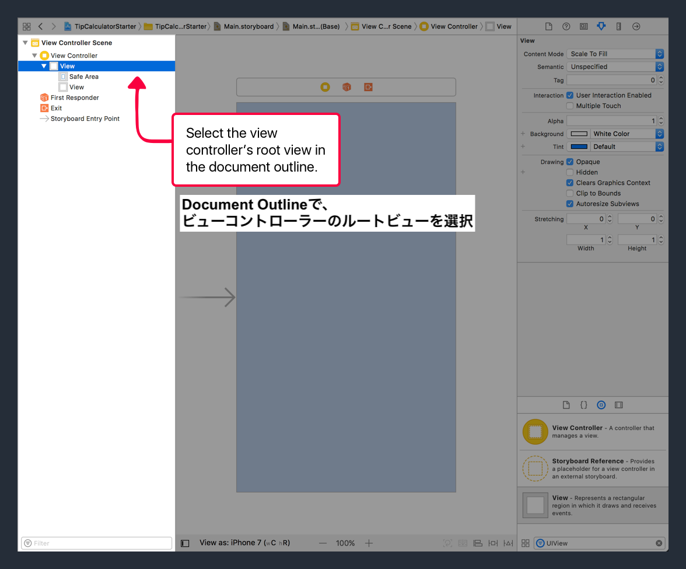
1. ルートビューを選択した状態で、ユーティリティエリアの属性インスペクターを開いてください。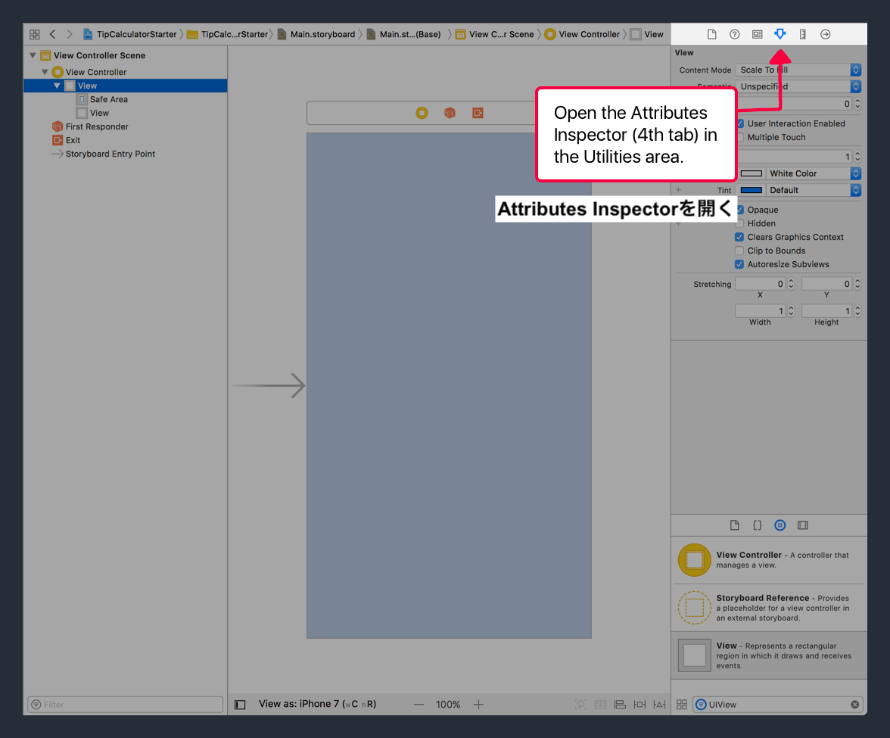
1. 次に、`Background Color`フィールドで、有効になっている色の横にある、青のドロップダウンボタンをクリックしてください。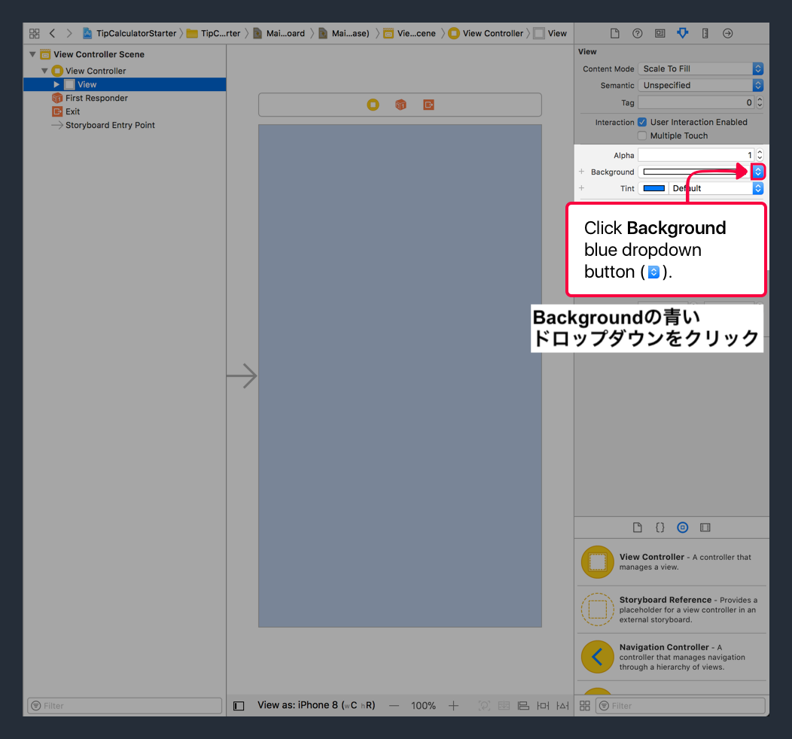
1. 最後に、 ドロップダウンメニューの _Named Colors_ のサブヘッダーに含まれている`Off-White`色を選択してください。

ルートビューの背景色の属性を異なる色に変更しました。 選択した`Off White`色は、`Assets.xcasset`のアセットカタログで予め定義されていました。

もっとビューを追加したり、もっと多くのプロパティを設定したりする前に、iOS座標系システムや`UIView`のframe属性とそのサブクラスについて学びましょう。ビューの位置とサイズを適切に設定するには、iOS座標系システムについて学ぶ必要があります。

# iOSの座標系

電話のスクリーンを、左上隅を起点とする座標系システムであるとみなすことができます。

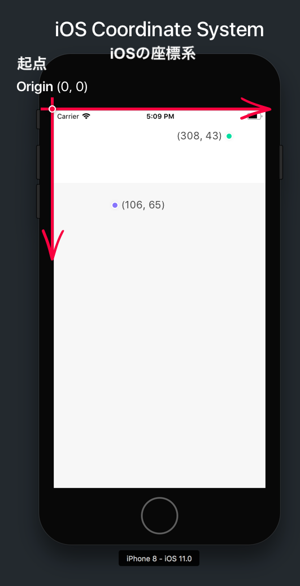

以前に述べたように、ビューはデバイスの画面上に描かれた長方形として表すことができます。この長方形は、その起点（長方形の左上隅）とサイズ（幅と高さ）で表すことができます。例を見てみましょう。

<!-- break -->

> [challenge]
上の画像では、赤色のビューの起点はどこですか？ サイズはどうでしょうか？

<!-- break -->

> [solution]
数字がついたX軸とY軸から分かるように、ビューの長方形はiOS座標系システムの点（27, 48）から開始しており、50ptの幅と35ptの高さを有しています。

Swiftにおいては、`CGPoint`と`CGSize`のデータのタイプがあり、それぞれ座標点とサイズを表しています。`CGPoint`の値は、XとYの値のペアです。`CGSize`の値は、幅と高さの値のペアです。

さらに、これら2つのデータタイプは、該当の点とサイズのプロパティによって表される長方形を表す「CGRect」データタイプ（X、Y、幅、高さ）と組み合わせることができます。

各`UIView`は`CGRect`タイプの`frame`と呼ばれるプロパティを持っています。各ビューのframeのプロパティを使って、その位置やサイズを操作できます。

> [info]
ある時点で、同じく`CGRect`である`bounds`と呼ばれるもう一つのビューのプロパティに出くわすでしょう。ビューの`frame`は、スーパービューの座標系システムにおけるビューの長方形を表しますが、`bounds`プロパティは、ビューの左上隅を座標系システムの起点として使用している長方形を指します。つまり、ビューの`bounds`プロパティの(x, y)は常に(0,0)となり、サイズも保持します。
>

新たな知識を得た今、ヘッダービューの位置とサイズをもう一度適切に設定してみましょう。

## ヘッダービューの長方形の設定

デザインを見直して、ヘッダービューの`CGRect`を決定することができます。

> [challenge]
ヘッダービューの`CGRect`（x, y, 幅, 高さ）はどうあるべきでしょうか。
>

<!-- break -->

> [solution]
ヘッダービューのframeは、（0, 0, 375, 105）です。

現在のヘッダービューのframeをStoryboardで変更しましょう。

> [action]
`Main.storyboard`で以下を実行してください：
>
1. インターフェイスビルダーにおいてヘッダービュー(UIView)を選択してください。
1. ヘッダービューが選択された状態で、ユーティリティエリアにおいてサイズインスペクターを開きます。
1. ビューの`Frame Rectangle`フィールドを見つけてください。サイズインスペクターのX、Y、幅、高さの値を、上の解答の長方形の値に変更してください。
>

>
変更がうまく動作するか確認しましょう！ ツールバーの実行ボタンをクリックすることで、iPhone 8のシミュレーター上でアプリをビルドし、実行します。

シミュレーターでは、オフホワイト色のルートビューに対して、カスタムヘッダービューが表示されるはずです。まだまだ魅力に欠けていますね！

ですが、画面のサイズが異なるシミュレーターでアプリを実行するとどうなるのでしょうか？

# 異なる画面サイズの取り扱い

iOSの座標系システム内でビューのframeを説明している前の図表をもう一度検討してみましょう。

複数の異なる画面サイズでアプリが実行されると何が起こるのでしょうか？

ご覧の通り、`UIView`のframeは、異なる画面サイズを持つ各デバイスによって違っている必要があります。

> [challenge]
何かこの問題を解決する方法をいくつか思いつきませんか？

## 自動レイアウトの導入

各画面サイズによって異なるframeを解決する方法の一つとしては、プログラムで計算をし、各ビューのframeを設定することです。ですが、これはかなり面倒ですし、各ビューが各画面に適したサイズになるようにするためだけにたくさんのコードを書かなくてはならない状態になってしまいます。

この問題を解決するために、Appleは _Auto-Layout_ と呼ばれる、相対的に位置を設定するツールを作成しました。 _Auto-Layout_ を使って、制約を定義します。

制約とは、2つのビューの間の相対的な位置またはサイズを定義できるルールです。 _Auto-Layout_ はすべての制約（ルール）が守られるようにするため、計算をすべて行い、ビューのframeを設定してくれます。これにより、どんな画面サイズの場合でも位置と形状を再び調整する、動的なビューのレイアウトを開発できるようになります。

例えば、私たちの見本のビューに以下の制約を与えることができます：

- Top（上）：Super View (Root View) のTop Edge（上側）から20pt
- Leading (左)： Super View (Root View) のLeading Edge（上側）から40pt
- Trailing (右)： Super View (Root View) のTrailing Edge（右側）から-80pt
- Bottom（下）：下から-380pt

> [info]
iOS座標系システムの方向に基づいた正と負の値に注意してください。

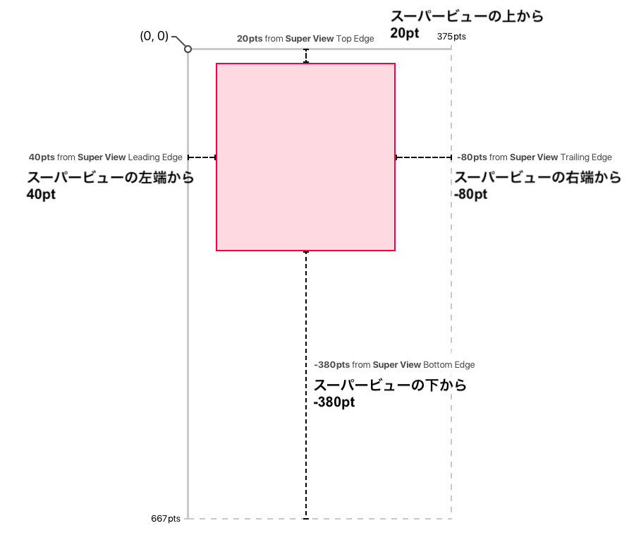

さて、画面が変わると、ビューはどう反応するのか見てみましょう：

異なる画面サイズそれぞれの制約に基づいて、Auto-layoutがビューのframeを計算しているのがわかりますね？

もしその代わり、固定の幅または高さを与えたい場合は、固定定数の制約を追加することもできます。私たちのビューの例に、新しい制約を与えてみましょう：

- Top(上)：Super View (Root View) のTop Edgeから20pt
- Leading (左)： Super View (Root View) のLeading Edgeから40pt
- Width (幅)：150pt
- Height(高さ)：200pt

Auto-layoutと制約によって、どんなiOSデバイスでも動的なビューレイアウトを簡単に作成できるようになります。

## 制約を決定する

制約を活用するため、インターフェースビルダーのヘッダービューを変更することにより、最初の制約を設定しましょう。

> [challenge]
ヘッダービューにはどんな制約を設定すべきでしょうか？ 

<!-- break -->

> [solution]
ヘッダービューには、以下の制約があるでしょう：
>
- Top（上）：Super View (Root View) のTop Edge（上側）から0
- Leading (左)： Super View (Root View) のLeading Edge（左側）から0
- Trailing (右)： Super View (Root View) のTrailing Edge（右側）から0
- Height（高さ）: 105pt

なかなかの出来栄えです。各デバイスにまたがるこれらの制約を持った、私たちのヘッダービューを見てみましょう：

待ってください。そんなに急がないで。iPhone Xの導入により、センサーハウジング（上部の切り欠き部分）とヘッダービューのframeに関してもう少し注意しなくてはなりません。

この上部の切り欠き部分を理由に、ヘッダービューの高さを、iPhone Xの上部切り欠き部分の下部に基づいて計算する必要があります。

これに対応するため、Appleはセーフエリアを提供しています。

## Safe Area (セーフエリア)

セーフエリアは、私たちのビューに対応する制約を正しく作成する助けとなる、貴重なレイアウト情報を提供してくれます。今回の場合は、セーフエリアの上部はステータスバーの下部と一致します。

元々の制約を修正するには、高さの制約をセーフエリアの下部から-85という制約と置き換える必要があります。これで、ヘッダービューは動的に各デバイスでのレイアウトを正確に計算してくれます。

少し見にくいかもしれませんが、上部切り欠きを理由に、ヘッダービューはiPhone Xの場合には少し高くなります。

正しい制約を使って、インターフェイスビルダーで設定しましょう。

## 初めての制約の設定

インターフェイスビルダーで制約を設定しましょう。まずは、top、leading (left)、そしてtrailing (right)の制約を追加することから始めます。

> [action]
プロジェクトナビゲーターから、`Main.storyboard`を開いてください。ヘッダービュー (`UIView`) を選択して、以下の制約を追加してください：
>

>
ヘッダービューを選択した状態で、_Add New Constraints_ ボタンをクリックし、各エッジの制約を設定します：
>
- ヘッダービューの _Top Edge_ : ルートビューの _Top Edge (上)_ まで 0pt
- ヘッダービューの _Leading Edge (左）_ : ルートビューの _Leading Edge (左) _ まで 0pt
- ヘッダービューの _Trailing Edge (右)_ : ルートビューの _Trailing Edge (右) _ まで 0pt

現時点では、私たちのヘッダービューの制約は不完全です。ビューの高さを定義する制約をまだ追加していません。今アプリを実行すると、ヘッダービューの高さが0になるので、ヘッダービューは表示されません。Xcodeとインターフェイスビルダー は、このことについて警告しようとしています：

以上では次のことがわかるでしょう：

1. Document Outlineで、欠けている制約をリスト化する赤色のエラー矢印
1. Storyboardのカスタムヘッダービューの周りに表示される赤のハイライト
1. Xcodeプロジェクトステータスバーにおける警告

ヘッダービューの高さを定義する最後の制約を追加しましょう。

> [action]
ヘッダービューのボトムエッジからセーフエリアのトップエッジに制約を追加します： 
>
ビデオで制約を追加するには、以下の手順に従ってください：
>
1. _Document Outline_ でヘッダービュー (`UIView`) を選択します。
1. _Document Outline_ で、ヘッダービューが選択された状態で、コントロール（Ctrl）ボタンを押さえたまま、ヘッダービューからセーフエリアビューへとクリックし、ドラッグしてください。
1. ドラッグすると、新しい制約を追加するオプションのあるポップアップが表示されます。「Vertical Spacing」を選択します。これは、ヘッダービューのトップエッジから、セーフエリアのトップエッジへ行間の制約を設定します。
1. （オプション）制約を調整したい場合は、クリックして、サイズインスペクターで値を調整することができます。

おめでとうございます。ヘッダービューに最初の制約のセットを追加しました。アプリを複数の異なるシミューレーターで実行してみて、ヘッダービューがそのframeを各デバイスに合わせて正しく調整するかどうか確認してください。

うまく行きました！ 次に、 _Auto-layout_ と様々な種類の利用可能な制約に取り組みましょう。

# 異なるタイプの制約

ヘッダービューの制約を適切に設定するにあたって、一種類の制約を使っただけですが、複雑なUIレイアウトを作成するために使える、様々な種類の制約が数多く用意されています。他に制約を設定する前に、動的なレイアウトを構築するために自動レイアウトによって使用することのできる共通の制約を見てみましょう。

## 相対的位置決め

まずは相対的な位置を決める制約を検討してみましょう。相対的な位置決めにより、あるビューの位置を、別のビューと相対的に決めることができます。例えば、青いビューを赤いビューのTrailing（右）側から45ptの場所に配置するという制約を作成できます：

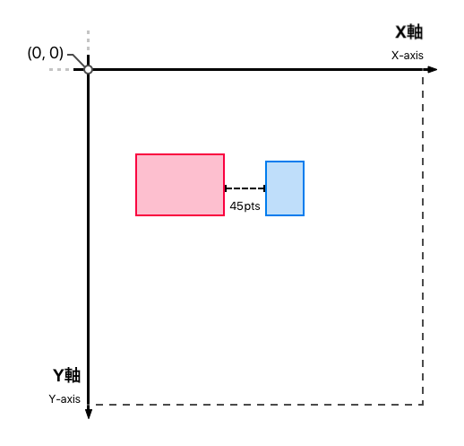

正の値や負の値（iOS座標系システムと相対）は、制約の方向性を示します。例えば、青のビューを赤のビューのトレイリング（右）側から-75ptの場所に配置するという制約を作成できます：

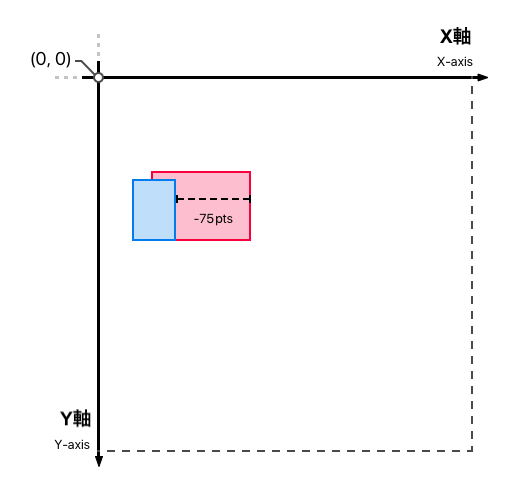

> [info]
相対的な位置決めの制約を作成している時は、どちらのビューのエッジから制約が開始するのか、制約が終わる他のビューのエッジ、及び制約の位置または負の値(方向)に留意しておく必要性があります。

相対的な位置決めの制約を設定するときは、何に対して相対的なのか注意しましょう。例えば、青のビューを赤いビューの20pt下に設定しましょう：

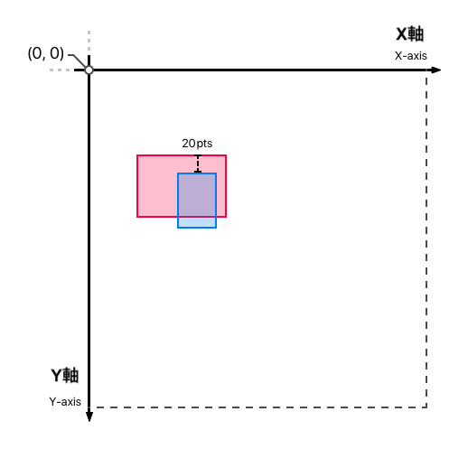

ですが、私たちが求めていたのはこれですか？ 上の場合では、青のビューに対して、赤のビューの20pt下となる制約を設定していますが、赤のビューの間違ったエッジに相対しています！

おそらく、私たちが実際に思い描いていたのは次の通りですね：

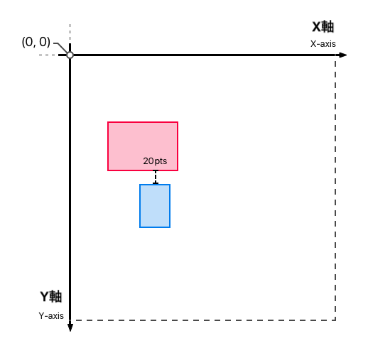

ご覧の通り、誤って、違うエッジに相対して制約を設定したり、ときには違うビューに制約を設定したりというのは非常によくある間違いです！

> [info]
ルートビューと相対的にビューの設定をするときには、セーフエリアを考慮することも重要です。ビューのトップエッジをルートビューのトップエッジに設定している場合、代わりにこれを間違って_セーフエリア_のトップエッジに設定したり、その逆をしたりしていないことを確認する必要があります。

## 一定のサイズ (高さまたは幅)

先ほどにも少し述べましたが、固定された定数の制約を設定することもできます。これらは、ビューの固定の幅や高さを設定するために使用されます。例えば、あるビューに固定幅と高さ100ptを与えることができます：

この場合、画面サイズが変化しても、赤いビューは常に同じサイズ（100x100）を保ちます。

> [info]
制約を追加したのに、ビューが見えないという状況に陥った場合、何か制約を追加し忘れたのかもしれません。各ビューのframeはAuto-layoutの制約によって決定可能な状態でなくてはならないことを忘れないでください。
>
前の例では、高さの制約の追加を忘れた場合、frameの高さが0となるため、ビューは表示されません。

## スーパービューの中心 (オフセット付き)

位置関係の制約として他に使えるのは、中心軸を垂直または水平に整列するものです。例えば、青いビューの中心を赤いビューに垂直に整列させる制約を作成できます：

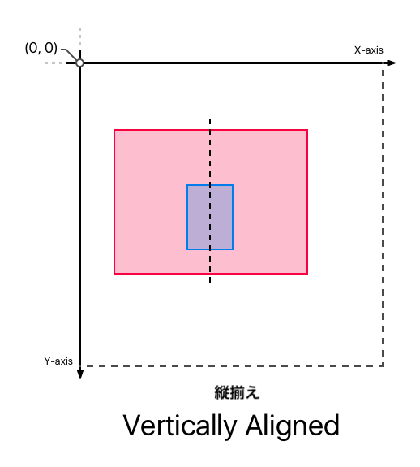

または、2つのビューを水平に整列させます：

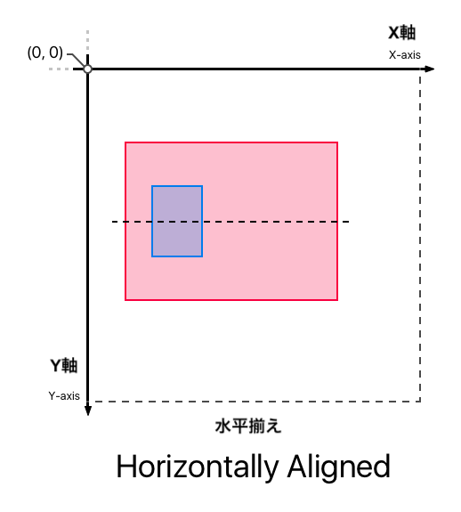

また、スーパービューから相対的に（正または負の方向を決定して）選択をすることができます：

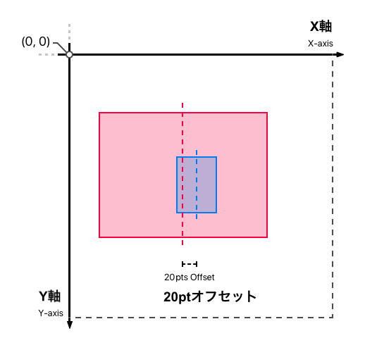

## 縦横比

アスペクト比の制約も利用可能です。・高さを幅の何倍かに設定したり、その逆もできます。これはビューが常に真四角（縦横比 1:1）であることを保証したい場合や、高さが常に幅の1/2であると決定した場合（縦横比　1:2）に便利になります。

以下の例では、縦横比を（1:3）に設定し、高さを幅の1/3にします：

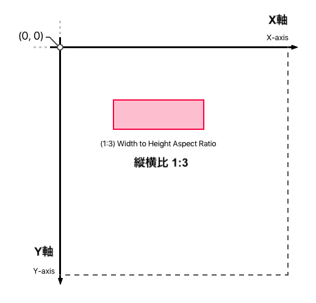

## 他の制約に等しい (比率)

最後に取り扱う制約は、別の制約からの相対的な比率で設定する制約です。これはある特定のビューのサイズを、別のビューと相対的に決定したい場合に便利です。例えば、青色のビューの高さを、赤色のビューの半分（1:2）に設定することができます。

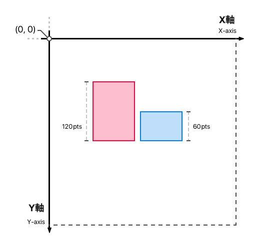

チップ計算機では、入力カードと出力カードのサイズを同じ高さにするために、この制約を使用します。

# ビューグルーピングに自動レイアウトを設定

デザインをもう一度見てみましょう：

次に、各UIグループのメインビュー（とその制約）を設定します。つまり、以下のオブジェクトと制約を追加するということです：

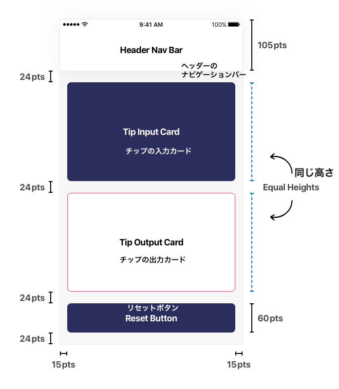

## 制約の実装

すでにヘッダービューの土台の実装は済んでいます。残りの各UIグループに関しても、同様のプロセスを繰り返します。

ヘッダーが完成したので、チップ入力カードの実装に移りましょう。

### 入力カードのビュー

> [action]
`Main.storyboard`を開いてください。新たな`UIView`を追加して、次の制約を設定してください：
>

>
ステップバイステップ：
>
1. _Object Library_ からルートビューへ`UIView`をドラッグします。
1. インターフェースビルダーエディタのウィンドウ右下隅の`Add New Constraints`ボタンをクリックしてください。
1. 以下の制約を設定してください：
    - （入力カード）ヘッダービューの _Bottom Edge（下）_から数えて_Top Edge（上）_ を24ptに
    - （入力カード）スーパービュー (Root View) の_Leading Edge（左）_から数えて_Leading Edge（左）_ を15ptに
    - （入力カード）スーパービューの _Trailing Edge（右）_ から数えて _Trailing Edge（右）_ を15ptに

新たな（入力カード）ビューの高さの制約が欠けているため、この時点で_Auto-layout_エラーが表示されます。今のところはこの警告を無視してください。すぐに修正します。

次に、出力カードとその制約を追加します。

### 出力カードビュー

> [action]
Storyboardで新しい`UIView`を追加して、以下の制約を設定してください：
>

>
ステップバイステップ：
>
1. _Object Library_ から、`UIView`を入力カードの下のビューコントローラーのルートビューへドラッグしてください。
1. インターフェースビルダーエディタのウィンドウ右下隅の`Add New Constraints`ボタンをクリックしてください。
1. 以下の制約を設定してください：
    - （出力カード）入力カードの _Bottom Edge（下）_から数えて _Top Edge（上）_ を24ptに
    - （出力カード）スーパービューの _Leading Edge（左）_から数えて_Leading Edge（左）_ を15ptに
    - （出力カード）Super View _Trailing Edge（右）_から数えて_Trailing Edge（右）_ を15ptに

入力カードビューと出力カードビューの間にも、同じ高さの制約を追加します。

> [action]
入力カードと出力カードの間で、等しい高さの制約を追加してください：
>

>
ステップバイステップ：
>
1. 出力カードビューを選択してください。
1. 出力カードが選択された状態で、シフトキーを押さえながら、入力カードビューをクリックしてください。これにより、両方のカードのビューを選択できるようになります。
1. インターフェースビルダーエディタのウィンドウ右下隅の`Add New Constraints`ボタンをクリックしてください。
1. ポップアップのプロンプトで、`Equal Heights`を選択して、選択された制約を追加してください。

各カードビューの高さを決定するのに十分な制約を追加していないため、 _Xcode_ はまだ _Auto-layout_ エラーを表示するはずです。今のところはこの警告を無視してください。リセットボタンを追加したら修正します。

### リセットボタン

> [action]
Storyboardで新しい`UIButton`を追加し、以下の制約を設定してください：
>

>
ステップバイステップ：
>
1. _Object Library_ から、`UIButton`を出力カードの下にあるビューコントローラーのルートビューへドラッグします。
1. インターフェースビルダーエディタのウィンドウ右下隅の`Add New Constraints`ボタンをクリックしてください。
1. 以下の制約を設定してください：
    - （リセットボタン）出力カードの _Bottom Edge（下）_ から数えて _Top Edge（上）_ を24ptに
    - （リセットボタン）スーパービューの _Leading Edge（左) _ から数えて _Leading Edge(左)_ を15ptに
    - （リセットボタン）スーハービューの _Trailing Edge（右）_ から数えて _Trailing Edge（右）_ を15ptに
    - （リセットボタン）スーパービューの _Bottom Edge（下）_ から _Bottom Edge（下）_ を24ptに
    - (リセットボタン) 高さ: 60pt

デフォルトで、ボタンにはクリアーな背景色が施されています。リセットボタンを見やすくするために、背景色を`Clear`から`tcDarkBlue`へ変更しましょう。

> [action]
リセットボタンの _Background color_ の変更：
>

>
ステップバイステップ：
>
1. リセットボタンを選択します。
1. _Reset Button_ が選択された状態で、ユーティリティエリアの属性インスペクターへ移動します。
1. `Background`フィールドを見つけるまで、スクロールダウンしてください。このフィールドでは、ボタンの背景色を設定できます。
1. ブルーのドロップダウンボタンを見つけ、ボタンの背景色を`Clear`から`tcDarkBlue`に変更してください。

<!-- break -->

> [info]
_Auto-layout_ の警告が消えました！ リセットボタンとその制約を追加した後で、等しい高さの制約を使うことで、 _Auto-layout_ は各入力/出力カードの高さを計算できます。

各UIグループのメインビューの実装が終わりました。各グループに適切な`UIView`オブジェクトを追加し、それに対応する制約を設定しました。

次に進む前に、すべてが期待通りに表示されるかどうかテストしてみましょう。

# 制約をテストする

早い段階でバグや間違いを見つけるには、コードを頻繁にビルドし実行するのがいつでも良い方法です。制約が適切に動作するかどうかテストしてみましょう。

> [action]
ツールバーで、 _Run_ ボタンをクリックしてください。

すべてが期待通りに行けば、シミュレーターでは次のように表示されるはずです。

色々なシミュレーターでプロジェクトを実行してみましょう。どんな画面サイズの場合でも、動的に調整とリサイズが行われることに気づくでしょう：

## 結論

このセクションでは、UIレイアウトの方法について学びました。最初はframe、そして次に _Auto-layout_ を使いました。複数のデバイスで動的なビューのレイアウトを構築するにあたり、制約について、及びその重要性について学びました。最後に、 チップ計算機のデザインの土台を実装することで、知識を実際に活用しました。

次のセクションでは、各UIグループをフルに実装して、スタイルを決めることで、UIを開発します。
