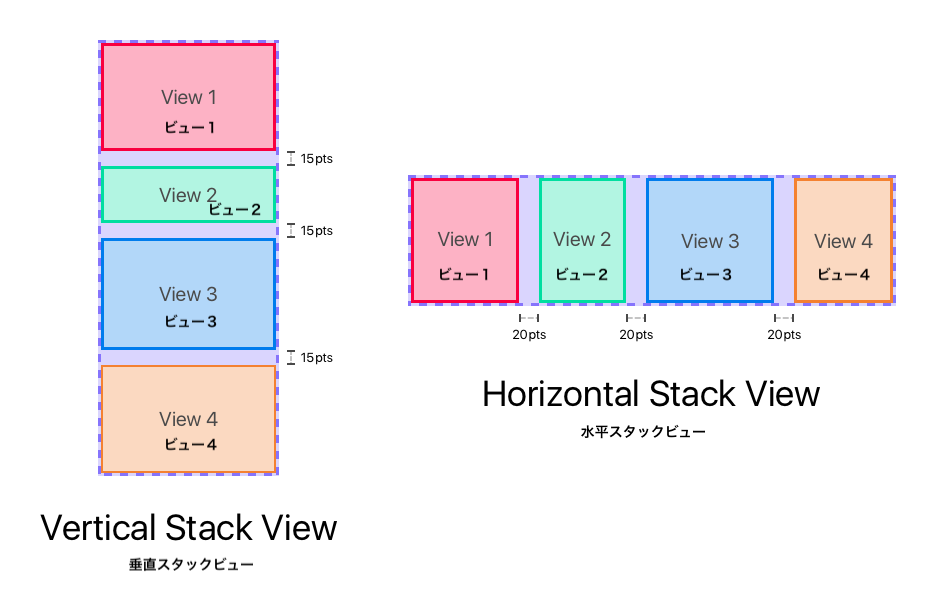
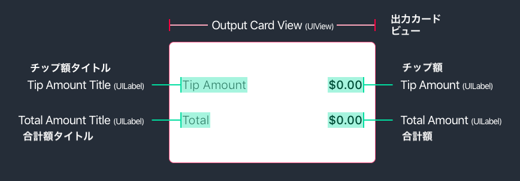
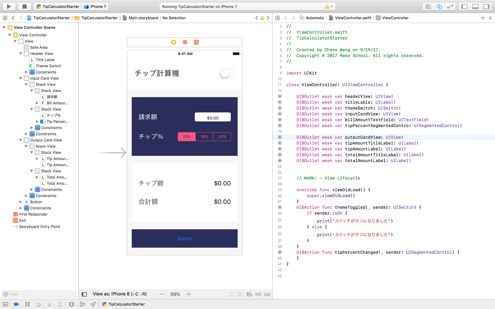

前のセクションでは、各UIグループのスケルトンをStoryboardに実装しました。プロジェクトをビルドして実行すると、アプリが次のように表示されます。


このセクションでは、各ビューグループを完成させます。

1. ヘッダー
1. チップ入力カード
1. チップ出力カード
1. リセットボタン

各ビューグループの実装を完成するには、以下を行う必要があります。

1. 正しい`UIKit`オブジェクトをそれぞれ追加
1. 各サブビューに対して _Auto-layout_ 制約を特定して設定
1. デザインに合わせて各サブビューの属性を設定
1. 適切な`IBoutlet`と`IBAction`を作成

まずは最初のUIグループであるヘッダーを完成させていきましょう。

# ヘッダービュー

前回の手順で既にヘッダーの基本ビュー (`UIView`) を追加しました。現在の状態では、ヘッダービューは次のように表示されます。


ヘッダービューの実装を完了するには、残りのサブビューを特定して追加する必要があります。

> [challenge]
下のデザインを使用して、ヘッダービューのUIを完成させるのに必要なビューを特定できますか？
>


<!-- break -->

> [solution]
ヘッダーを作成するには、次のビューオブジェクトが必要です。
>
- `UILabel`: タイトルラベル
- `UISwitch`: テーマ色のスイッチ

追加する必要がある両方のビューオブジェクトを特定したら、 これらを追加して、それぞれの制約を設定する必要があります。タイトルラベルの作業を始めましょう！

## タイトルラベル

### 制約の識別

Storyboardに制約を追加していく前に、一歩下がって、タイトルラベルに必要な制約をすべて割り出しましょう。

> [challenge]
下のデザインを使って、タイトルラベルに対する _Auto-layout_ の各制約を特定しましょう。各制約を紙に書き出します。
>
ヒント: 赤い領域はラベルのフレームを表しています。
>


あなたの答えを下の解答で確認しましょう。

> [solution]
私たちのデザインによると、ラベルには次の制約が必要です。
>

>
**制約**:
>
- （ラベル）スーパービュー(ヘッダービュー) のLeading Edge（左）から数えてLeading Edge（左）を24ptへ
- （ラベル）スーパービューの Bottom Edge（下）から数えてBottom Edge （下）を0ptへ
- （ラベル）セーフエリアの Top Edge（上）から数えてTop Edge を0ptへ

### 制約を追加する

制約を特定したら、 _Interface Builder_ を使って、新しい`UILabel`とその制約を追加できます。

> [action]
`Main.storyboard`を開いて、タイトルラベルとその制約を実装します。
>

>
ステップバイステップ：
>
1. `UILabel`を _Object Library_ からドラッグして、ヘッダービュー (`UIView`) の上にドロップします。
1. 新しい`UILabel`を選択した状態で、`Add New Constraints`ボタンをクリックします。
1. 次の最初の制約2つを、`Add New Constraints`ポップアップを使って追加します。
    - （ラベル）スーパービューの Leading Edge（左）から数えてLeading Edge（左）を24ptへ
    - （ラベル）スーパービューの Bottom Edge（下）から数えてBottom Edge（下）を0ptへ
1. 最後の制約を追加するために、 _Document Outline_ の`UILabel`を選択します。
1. `UILabel`を選択した状態で、Ctrlを押しながらクリックして _Document Outline_ の _Safe Area_ オブジェクトまでドラッグします。
1. 新しい制約を追加するポップアップが表示されます。`Vertical Spacing`を選択します。ちょっと待ってください。新しい`Vertical Spacing`の制約は適切に設定されていません。
1. 新しい`Vertical Spacing`にカーソルを重ねてクリックします。属性が属性インスペクタに表示されます。
1. 属性インスペクタで制約の属性を変更します。
    - _Second Item_: `Label.Bottom`から`Top`に変更
    - _Constant_: `-85`から`0`に変更

<!-- break -->

> [info]
各ビュー オブジェクトの _Auto-layout_ の制約を特定し、設定するのは初心者には厄介かもしれません。うまく行かない場合は、ペースを落として、レイアウトの問題を小さな問題に分けてみてください。練習し続ければ、もっと簡単に制約を使えるようになるでしょう。

素晴らしい！ タイトルラベルをヘッダーに追加しました。プロジェクトをビルドして実行すると、次のように表示されます。


それでも ... まだしっくりきません。私たちのタイトルラベルは、まだ最終デザインに近くありませんね。

これは、属性インスペクタを使用して、デザインに合った`UILabel`属性を設定しなければならないからです。

### 属性の設定

> [action]
`Main.storyboard`で、ヘッダービューのタイトル ラベルを選択します。 _Utilities_ エリアの属性インスペクタに移動して、次の属性を変更します。
>
- _Text_: `Label` から `チップ計算機`へ変更 
- _Font_: `System 17.0` から `System Bold 24.0`へ変更
- _Font Color_: `Default` から `tcCharcoal`へ変更

上記の各属性を設定すると、タイトルラベルは次のようになります。


かなりいい感じですね？ `UISwitch`に進みましょう。

## ライト/ダークモード (テーマ) スイッチ

制約を特定します。オブジェクトを追加して制約を設定します。属性を設定します。さっぱり洗い流します。もう一度繰り返します。

このチュートリアルが終わるまで、このプロセスを何回も繰り返します。自分のアプリを開発するときも同じプロセスを行うことになるので、ぜひ慣れてください。

まず、`UISwitch`に必要な制約を特定しましょう。

### 制約の識別

> [challenge]
下のデザインを使って、タイトルラベルに対する_Auto-layout_の各制約を特定しましょう。制約を1つずつ紙に書き出します。
>
ヒント: 赤い領域はスイッチのフレームを表しています。
>


あなたの答えを下の解答で確認しましょう。

> [solution]
設計に基づいて`UISwitch`は次の制約:
>

>
**制約**:
>
- （スイッチ）スーパービュー (ヘッダービュー) のTrailing Edge（左）から数えてTrailing Edge（左）を24ptに
- （スイッチ）ラベルの Trailing Edge（左）から数えてLeading Edge（左）を ≥20ptに
- （スイッチ）ラベルの Center（中央）とCenter vertically（中央揃え）

### 制約を追加する

これらの制約を`UISwitch`に追加していきましょう。

> [action]
`Main.storyboard`を開いて、`UISwitch`とその制約を実装します。
>

>
ステップバイステップ：
>
1. `UISwitch`を _Object Library_ からドラッグして、ヘッダータイトルラベルの横にドロップします。
1. `UISwitch`を選択した状態で、`Add New Constraints`ボタンをクリックします。
1. 次の2つの制約を、`Add New Constraints`ポップアップを使って追加します。
    - （スイッチ）スーパービューの Trailing Edge(右)からTrailing Edge(右) へ24pt
    - （スイッチ）ラベルの Trailing Edge（右)からLeading Edge(左)へ 20pt
1. ラベルに対するスイッチの前辺の端の制約にカーソルを合わせて、これをクリックします。属性が属性インスペクタに表示されます。
1. 属性インスペクタを使用して、制約の _Relation_ 属性を`Equal`から`Greater Than or Equal`に変更します。
1. `UISwitch`をクリックして再び選択します。（1つ前の手順の制約を選択していないことを確認してください。）
1. スイッチを選択した状態で、Ctrlを押しながらクリックして`UISwitch`から`UILabel`までドラッグします。
1. 新しい制約を追加するポップアップが表示されます。`Center Vertically`を選択して、スイッチの中心をラベルの中心に縦方向に揃えます。

素晴らしい！ 制約を追加して`UISwitch`に設定しました。では、スイッチの属性を設定しましょう。

### 属性の設定

> [action]
`Main.storyboard`で、ヘッダービューのスイッチを選択します。 _Utilities_ エリアの属性インスペクタに移動して、次の属性を変更します。
>

>
**属性:**
>
- _State_: `On`から`Off`に変更
- _On Tint_: `Default`から`tcSeafoamGreen`に変更

完了すると、カスタム ヘッダービューは次のようになります。


## IB 接続を追加する

最初のUIグループの実装完了までもう少しです！ 仕上げに`IBoutlet`と`IBAction`を作成する必要があります。

`IBoutlet`と`IBAction`により、Swiftコードでイベントを受け取ったり、Storyboardビューと対話したりできます。

`IBoutlet`はSwiftコードで参照できるインスタンス変数を作成します。これによりタイトルラベルやスイッチと、プログラムを通じて対話できます。

`IBAction`は、トリガされるとコードを実行する関数を作成します。これらの関数は、ユーザーによるUI要素の操作によってトリガされます。よくある例は、ユーザーがボタンをタップした場合です。ボタンがタップされると、`IBAction`をトリガして、対応する関数内のコードを実行します。

チップ計算機のロジックを実装するため、これらの接続の両方が後で必要になります。

まずはヘッダービュー (`UIView`) 用に、最初の`IBOutlet`を作成しましょう。

> [action]
アシスタント エディタを使って`Main.storyboard`ファイルと`ViewController.swift`ファイルを並べて開きます。
>

>
IB 接続を作成するには、まずStoryboardを開いてビュー コントローラーソース コードを並べて確認します。
>
1. `Main.storyboard`をメインエディタで開きます。
1. Optionボタンを押しながら、プロジェクトナビゲーターの`ViewController.swift`ファイルをクリックします。アシスタントエディタでビューコントローラーが開きます。
1. (任意) Xcode ツールバーを使って _Utilities_ エリアを非表示にすることで、プロジェクト内のスペースを増やします。

`Main.storyboard`ファイルと`ViewController.swift`ファイルを並べて、ヘッダー用の`IBOutlet`を作成しましょう。

> [action]
`headerView`というヘッダーの`IBOutlet`を作成します。
>

>
ステップバイステップ：
>
1. _Document Outline_ でヘッダービュー (`UIView`) を選択します。
1. ヘッダービューを選択した状態で、_Document Outline_ のヘッダービューから`ViewController`クラス定義内のSwiftコードへ、Ctrlを押しながらクリックしてドラッグします。
1. 新しいIBコネクションを作成するためのポップアップが表示されます。nameフィールドを`headerView`と設定します。
1. _Connect_ をクリックして、新しい`IBOutlet`を作成します。

新しい`IBOutlet`インスタンス変数が、`ViewController`クラスに表示されるはずです。

```
class ViewController: UIViewController {

    @IBOutlet weak var headerView: UIView!

    // MARK: - View LifeCycle

    override func viewDidLoad() {
        super.viewDidLoad()
    }
}
```

ご覧の通り、Swiftコードでヘッダービューを`headerView`として参照できます。

素晴らしい！ 反復は学習の母です。もう一度試してみましょう。

> [action]
ヘッダービューの`titleLabel`というタイトルラベルの`IBOutlet`を作成します。
>

>
ステップバイステップ：
>
1. Storyboardビューコントローラーで、タイトルラベル (`UILabel`) を選択します。
1. ヘッダービューを選択した状態で、ラベルから`ViewController`クラス定義内のSwiftコードへ、Ctrlを押しながらクリックしてドラッグします。
1. 新しいIBコネクションを作成するためのポップアップが表示されるはずです。nameフィールドを`titleLabel`と設定します。
1. _Connect_ をクリックして、新しい`IBOutlet`を作成します。

<!-- break -->

> [info]
前回は _Document Outline_ のヘッダービューからCtrlを押しながらドラッグして`IBOutlet`を作成しました。今回はラベルのStoryboard オブジェクトからCtrlを押しながらドラッグして`IBOutlet`を作成します。どちらの`IBoutlet`の作成方法も有効です。

この時点で、`IBOutlet`の作成方法を2回説明しました。あなたの番です。

> [challenge]
`themeSwitch`という名前の`UISwitch`用に`IBOutlet`を作成します。行き詰まったら、前に戻って、以前2つの`IBoutlet`を作成する際に使った手順を参照しましょう。

<!-- break -->

> [solution]
スイッチ用に`IBOutlet`を作成すると、`ViewController.swift`ファイルは次のようになるはずです。
>
```
class ViewController: UIViewController {
>
    @IBOutlet weak var headerView: UIView!
    @IBOutlet weak var titleLabel: UILabel!
    @IBOutlet weak var themeSwitch: UISwitch!
>
    // MARK: - View LifeCycle
>
    override func viewDidLoad() {
        super.viewDidLoad()
    }
}
```

解決策をチェックしたら、最初の`IBAction`の作成に移りましょう。

スイッチ用の`IBAction`を作成する必要があります。これにより、スイッチが切り替えられるたびにコードを実行できるようになります。

> [action]
`Main.storyboard`ファイルと`ViewController.swift`ファイルの両方をアシスタントエディタで開きます。スイッチ用に新しい`IBAction`を作成します。
>

>
ステップバイステップ：
>
1. _Document Outline_ でスイッチ (`UISwitch`) を選択します。
1. スイッチを選択した状態で、Ctrlを押しながら _Document Outline_ から`ViewController`クラスへドラッグします。
1. 新しいIBコネクションを作成するためのポップアップが表示されます。ポップアップで _Connection_ 型を`Outlet`から`Action`に変更します。このプロパティを変更すると、異なる種類のIBコネクションを作成できるようになります。
1. アクションの名前を`themeToggled`に設定します。
1. _Type_ プロパティを`Any`から`UISwitch`に変更します。
1. _Event_ プロパティが`Value Changed`に設定されていることを確認します。設定されていない場合は、ドロップダウンを使って`Value Changed`に設定します。
1. _Connect_ をクリックして、新しい`IBAction`を作成してください。

<!-- break -->

> [info]
スイッチの`IBAction`を作成したら、アシスタントエディタを閉じます。画面のスペースがあまりない場合は、必要に応じて _アシスタントエディタ_ を開いたり閉じたりしましょう。

新しい`IBAction`のテストを行って、正しく機能するか確認しましょう。

> [action]
プロジェクトナビゲーターから`ViewController.swift`を開いて、次のコードを`themeToggled`関数に追加します。
>
```
@IBAction func themeToggled(_ sender: UISwitch) {
    if sender.isOn {
        print("スイッチがオンになりました")
    } else {
        print("スイッチがオフになりました")
    }
}
```

上記のコードを追加したら、`IBAction`をテストできます。

> [action]
プロジェクトをビルドして実行します。スイッチのオン・オフを数回切り替えます。Xcodeの _Debugger_ エリアを見ると、スイッチを切り替えるたびに次の出力ステートメントがコンソールに表示されるはずです。
>


ヘッダービューのUIとIBコネクションの実装が完了しました。`Main.storyboard`ファイルと`ViewController.swift`ファイルを並べると次のように表示されます。


プロジェクトをビルドして実行すると、アプリは次のようになります。


もっと練習したい場合は朗報です！入力カード、出力カード、リセットボタンビューについて同じ手順を再び繰り返す必要があります。どんどん進めていきましょう！

> [info]
もっと先に進むと、すべてのサブビューコンポーネントを抽象化するカスタムビューオブジェクトの作成について学習します。カスタムビューを作成すると、カスタムビューを再利用できるようになり、コードを分離できます。これはちょっと高度なので、このチュートリアルの対象範囲外です。

# 入力カードビュー

次に実装するUIグループは入力カードです。デザインをもう一度見てみましょう。


入力カードについては、次のUIコンポーネントを追加する必要があります。


2つのラベル、1つのテキストフィールド、1つのセグメンテッドコントロールが必要です。次に、 _Auto-layout_ を使ってデザインを構築する方法を考えましょう。

## 制約の識別

ヘッダービューを作成するにあたって、制約を使って動的なビューレイアウトを作成しました。今回は`UIStackView`という新しいツールを紹介します。

### スタックビュー

`UIStackView`を使うと、ビューの横方向または縦方向のスタックを作成できます。行や列のレイアウトを整理するのに便利です。

どんな感じか見てみましょう。



両方とも、各スタックビューに複数のサブビューが用意されているのがわかります。`UIStackView`は、内部の各サブビューのフレームの計算を自動的に処理します。

スタックビューを使用して、制約を自分で追加せずに、簡単に入力サブビューのレイアウトを作成します。

横方向のスタックビューを使って、ビューの最初の行をグループ化する方法を見ていきましょう。


ご覧の通り、 _Bill Amount_ タイトルラベルと _Bill Amount_ テキストフィールドの両方が1つの`UIStackView`に追加されています。上の画像の紫の部分は、スタックビューのフレームを示しています。

同様に、もう1つの横方向のスタックビューを使って、 _Tip Percent Title_ サブビューと _Tip Segmented Control_ サブビューをレイアウトできます。どんな感じになるか見てみましょう。


各`UIStackView`は、その内部に含まれる各サブビューのフレームを計算します。その一方で、各`UIStackView`のフレームをどうにかして定義する必要があります。

スタックビューと制約に関してわかっている知識を活用して、横方向のスタックビュー両方を入力カードの中央に配置します。

最初に、横方向のスタックビュー両方を格納している、縦方向のスタックビューを追加します。


次に、制約を使って外側のスタックビューを動的に中央に配置します。


次の制約を外側のスタックビューに追加します。

- （外側スタックビュー）スーパービュー (入力カード) のLeading Edge（左）から数えてLeading Edge（左）を 22ptに
- （外側スタックビュー）スーパービューの Trailing Edge（右）からTrailing Edge（右） 22pt
- （外側のスタックのビュー）スーパービューの Center（中央）とCenter vertically aligned （中央揃え）

各ビューが正しい幅であることを保証するために、幅の制約をもういくつか追加しなければなりません。

まずは、両方の内側（水平）スタックビューに同等の幅を追加することから始めます。


上の画像では、次の2つの制約を追加します：

- （内側のトップスタックビュー）外側のスタックビューと同じ幅
- （内側のボトムスタックビュー）外側のスタックビューと同じ幅

名前の通り、これら2つの _Equal Widths_ の制約は、内側スタックビューの幅を外側スタックビューと同じになるように定義します。

最後に、`UITextField`と`UISegmentedControl`のそれぞれに幅の制約を追加する必要があります。


幅に関する制約：

- （請求金額のテキストフィールド）Width 118pts
- （チップ%のセグメント化されたコントロール）Width 173pts

フーッ！ 入力カードに必要な制約は、これで最後です。

ご覧の通り、スタックビューと制約の組み合わせは、開発者に対して複雑なUIレイアウトを作成する高い能力を与えてくれます。

入力カードのレイアウトの実装方法の見当がついたので、実際に開発を始めましょう！

## 制約を追加する

入力カードのレイアウトはかなり複雑です。実装を小さなステップに分解することで簡単にしましょう。

内側のトップスタックビュー、 _Bill Amount Stack View_ から始めます。

### 請求額スタックビュー

まずはスタックビューのサブ要素を追加する必要があります。

> [action]
`Main.storyboard`で、「UILabel」と「UITextField」をビューコントローラーに追加してください。
>

>
ステップバイステップ：
>
1. `UILabel`を _Object Library_ からドラッグして、入力カードビュー（`UIView`）の上にドロップします。
1. `UITextField`を _Object Library_ からドラッグして、以前のラベルの隣に配置します。
1. 両方のサブビューが水平かつ隣り合わせに配置されているようにしてください。これはスタックビューを作成する際に重要となります。

次に、2つの新たなビューから、最初の`UIStackView`を作成しましょう。

> [action]
ラベルとテキストフィールドを使って _Bill Amount Stack View_ を作りましょう。
>

>
1. _Bill Amount Title Label_ （`UILabel`) をStoryboardから選択してください。
1. シフトキーを押さえながら、`UITextField`をクリックしてください。これで複数の項目を同時に選択できるようになります。
1. ラベルとテキストフィールドの両方が選択された状態で、`Add New Constraints`ボタンの近くの`Embed In Stack`ボタンをクリックしてください。 _エディタエリア_ の右下隅にあります。
1. （任意） _Document Outline_ を見れば、新しい`UIStackView`を参照できます。 _Document Outline_ においてスタックビューを拡大すると、各ビューのサブビューを参照できます。

Storyboardは次のように表示されるはずです。


少し調整作業が必要ですね。スタイリングについてはまだ考えなくてもいいです。次に、内側のボトムスタックを作成しましょう。

### チップ%のスタックビュー

まずは _Tip Percent Stack View_ のサブビューを追加します。

> [action]
`Main.storyboard`で、`UILabel`と`UISegmentedControl`をビューコントローラーに追加してください。
>

>
ステップバイステップ：
>
1.  _Object Library_ から`UILabel`をドラッグして、最初のラベルの下にドロップします。
1. `UISegmentedControl`を _Object Library_ からドラッグして、新しいラベルの隣、テキストフィールドの下に配置します。
1. ラベルとセグメント化されたコントロールの両方が水平かつ隣り合わせに配置されるようにしましょう。さらに、以前のスタックビューの下に配置されるようにしてください。

さて、次は2つ目の内側のスタックビューの作成に移ります。

> [action]
ラベルとセグメント化されたコントロールを使って _Tip Percent Stack View_ を作成します。
>

>
1. Storyboardで _Tip Percent Title Label_ (`UILabel`) を選択してください。
1. シフトキーを押さえながら、`UISegmentedControl`をクリックしてください。これで複数の項目を同時に選択できるようになります。
1. ラベルとセグメント化されたコントロールの両方が選択された状態で、`Add New Constraints`ボタンの近くの`Embed In Stack`ボタンをクリックしてください。エディタエリアの右下隅にあります。
1. （任意） _Document Outline_ を見れば、新しい`UIStackView`を参照できます。 _Document Outline_ においてスタックビューを拡大すると、各ビューのサブビューを参照できます。

Storyboardは次のように表示されるはずです。


スタックビューは両方ともスタイル設定を行なっていない状態のはずです。これには、制約の追加が済んだら取りかかります。

次に、外側のスタックビューを作成しましょう。

### 外側のスタックビュー

> [action]
両方の内側（水平）スタックビューを利用して外側のスタックビューを作成しましょう。
>

>
ステップバイステップ：
>
1. _Document Outline_ で内側のスタックビューを折り畳んでください。
1. _Document Outline_ で内側のスタックビューを選択してください。
1. 以前の内側のスタックビューが選択された状態で、別の内側のスタックビューをシフトを押さえながらクリックして、両方の内側のスタックビューを同時に選択してください。
1. 両方の内側のスタックビューが選択された状態で、`Embed In Stack`ボタンをクリックしてください。
1. （任意） _Document Outline_ で、新しいスタックビューとそのサブビューを閲覧できます。

現在、Storyboardは次のように表示されるはずです。


内側と外側のスタックビューの制約が作成されたところで、 _Auto-layout_ が各スタックビューのフレームを決定できるようにするため、もう少し制約を追加する必要があります。

残りの外側のスタックビューの制約から始めましょう。

> [action]
外側のスタックビューのフレームに以下の制約を設定してください。
>

>
ステップバイステップ：
>
1. _Document Outline_ で、外側のスタックビューを選択してください。
1. 外側のスタックビューが選択された状態で、`Add New Constraints`ボタンをクリックしてください。
1. 次の2つの制約を、`Add New Constraints`ポップアップを使って追加します。
    - （外側のスタックビュー）スーパービュー(入力カード) Leading Edge（左）から数えてLeading Edge（左）を 22ptに
    - （外側のスタックビュー）スーパービューの Trailing Edge（右）から数えてTrailing Edge（右）を 22ptに
1. _Document Outline_ で、コントロール（ctrl）キーを押さえながらクリックし、外側のスタックビューからスーパービュー（入力カード）へドラッグしてください。
1. ポップアップが出たら、新たな制約を作成するために`Center Vertically In Container`を選択してください。そうすれば、外側のスタックビューの中心と、スーパービューの中心を、垂直に整列できます。

次に、外側と内側のスタックビューの幅を同じにするため、等幅の制約を追加します。

### 等幅の制約

> [action]
各スタックビューに等幅の制約を設定してください。
>

>
ステップバイステップ：
>
1. _Document Outline_ で内側のスタックビューを折り畳んでください。
1. _Document Outline_ で、外側のスタックビューを選択してください。
1. 3つのスタックビューすべてを同時に選択するために、外側のスタックビューが選択された状態で、下の内側のスタックビューを、シフトを押しながらクリックしてください。
1. すべてのスタックビューが選択された状態で、`Add New Constraints`ボタンを押してください。
1. 等幅の制約を作成するために、`Equal Widths`のチェックボックスを選択し、`Add 2 Constraints`をクリックしてください。

これまでの進歩：


テキストフィールドとセグメント化されたコントロールのそれぞれに、幅に関する最後の制約を追加しましょう。

### 固定幅の制約

> [action]
 _請求額(Bill Amount) Text Field_ に幅の制約を設定してください。
>

>
ステップバイステップ：
>
1. _Document Outline_ で`UITextField`オブジェクトを選択してください。
1. テキストフィールドが選択された状態で、`Add New Constraints`ボタンをクリックしてください。
1. 固定幅の制約を118ptsに設定してください

最後に、`UISegmentedControl`に固定幅の制約を追加する必要があります。自分で実装できるかどうか試してみましょう。

> [challenge]
 _チップ％（Tip Percent） Segmented Control_ のオブジェクトに幅の制約を追加してください。幅を173ptsに設定してください。問題が生じたり、行き詰まってしまったりしたら、テキストフィールドに幅の制約を追加した、前の例を見てください。

以下で解答を確認してください。

> [solution]
_チップ％（Tip Percent） Segmented Control_ の幅の制約を以下によって設定します。
>

>
ステップバイステップ：
>
1. _Document Outline_ で`UISegmentedControl`オブジェクトを選択してください。
1. セグメント化されたコントロールが選択された状態で、`Add New Constraints`ボタンをクリックしてください。
1. 固定幅の制約を173ptsに設定してください。

作業を始めてから、かなり遠くまでやってきました。スタックビューの追加をすべて終え、各ビューの制約も設定できました。


入力カードの外見は私たちのデザインに近づき始めています。次に、入力カードのビューの属性の設定に取り組みましょう。

## 属性の設定

この時点ではもう、インターフェイスビルダーを使ってStoryboardオブジェクトの属性を設定する方法について慣れているはずです。

確認のため少し一緒に作業してみて、残りは一人で作業をしてもらいます。

### 入力カードの背景色

> [action]
_Input Card_ の背景色を`tcDarkBlue`に設定してください。
>

>
ステップバイステップ：
>
1. 入力カードビューを選択してください (`UIView`)。
1. ユーティリティエリアで属性インスペクターを開いてください。
1. _Background_ の属性を見つけ、青色のドロップダウンボタンを使って、その値を`White Color`から`tcDarkBlue`に変更してください。

次はあなたの番です。

> [challenge]
各要素に以下の属性を設定しましょう：
>
**外側のスタックビュー：**
>
- _Spacing_： `0`から`35`に変更
>
**請求額（Bill Amount）Title Label（内側のトップスタックビュー）：**
>
- _Text_： `Label`から`請求額`に変更
- _Font_： `System 17.0`から`System 20.0`に変更
- _Color_： `Default`から`tcWhite`に変更
- _Alignment_： `---`から`Left Aligned`に変更
>
**請求額（Bill Amount） Text Field（内側のトップスタックビュー）：**
>
- _Alignment_： `---`から`Center Aligned`に変更
- _Placeholder_： 空の状態から`$0.00`に変更
- _Correction_： `Default`から`No`に変更します。
- _Keyboard Type_：`Default`から`Decimal Pad`に変更
- _Keyboard Look_： `Default`から`Light`に変更
- _Tint_： `Default`から`tcHotPink`に変更
>
**チップ％（Tip Percent） Title Label（内側のボトムスタックビュー）：**
>
- _Text_： `Label`から`チップ%`に変更
- _Font_： `System 17.0`から`System 20.0`に変更
- _Color_： `Default`から`tcWhite`に変更
- _Alignment_： `---`から`Left Aligned`に変更
>
**チップ％（Tip Percent） Segmented Control（内側のボトムスタックビュー）：**
>
- _Segments_： `2`から`3`に変更
- _Tint_： `Default`から`tcHotPink`に変更

設定が必要な最後の属性は、セグメント化されたコントロールの各セグメントのタイトルです。

> [action]
セグメント化されたコントロールの各セグメントに、タイトル属性をそれぞれ`15%`、`18%`、`20%`と設定してください。
>


プロジェクトをビルドし、実行して、どれぐらい進んだか確かめてみましょう。


ビンゴ！　私たちのアプリとデザインが一致しました（もちろん、丸みのある角に関しては例外です。）

> [info]
丸い角（と影）は私たちのビューのレイヤーのプロパティを活用します。これは、このチュートリアルの後半で取り扱います。

入力カードに必要なIBコネクションを作成して、次に進みましょう。

## IB 接続を追加する

これは以前にヘッダービューで行いました。IBコネクションを作成して、もっと練習を積みましょう。

復習のため、もう一つ一緒に行いましょう。

入力カードのために(`UIView`)`IBOutlet`を作成しましょう。

> [action]
入力カードビューのために`IBOutlet`を作成します。
>

>
ステップバイステップ：
>
1. エディタエリアにおいて`Main.storyboard`を開きます。
1. プロジェクトナビゲーターでオプションを押しながら`ViewController.swift`をクリックし、アシスタントエディタでこれを開いてください。
1. （オプション）ユーティリティエリアを非表示にして、アシスタントエディタ用のスペースをもっと確保しましょう。
1. 入力カードビューを選択してください (`UIView`)。
1. 入力カードが選択された状態で、コントロールキーを押しながらクリックし、入力カードから`ViewController`クラスへドラッグしてください。
1. ポップアップで、 _Name_ のフィールドを`inputCardView`に設定し、Connectをクリックして新しいアウトレットを作成します。

<!-- break -->

> [challenge]
次は、自分で練習する番です。行き詰まったら、以前に`IBoutlet`をどのように実装したかを見直して、記憶をリフレッシュしてください。
>
以下の`IBoutlet`を作成します：
>
- `billAmountTextField`という名の`UITextField`
- `tipPercentSegmentedContro`という名の`UISegmentedControl`

最後に、セグメント化されたコントロールのために`IBAction`を作成する必要があります。

> [challenge]
`UISegmentedControl`用に`IBAction`を実装してみましょう。 _Name_ を`tipPercentChanged`と設定して、 _Event Type_ が`Value Changed`になっていることを確認してください。行き詰まったら、チュートリアルを見直すか、解答を確認してください（本当に行き詰まったときだけにしましょう！）

<!-- break -->

> [solution]
`IBAction`の作成は、`IBOutlet`の作成に似ています：
>

>
ステップバイステップ：
>
1. _Document Outline_ でセグメント化されたコントロールを選択してください(`UISegmentedControl`)。
1. セグメント化されたコントロールを選択した状態で、ctrl を押しながらクリックして、＿Document Outline＿ のセグメント化されたコントロールを、`ViewController`クラスへドラッグしてください。
1. 新しいIBコネクションを作成するためのポップアップが表示されます。ポップアップで _Connection_ 型を`Outlet`から`Action`に変更します。
1. アクションの名前を`tipPercentChanged`に設定します。
1. _Type_ のプロパティを`Any`から`UISegmentedControl`に変更してください。
1. _Event_ のプロパティが`Value Changed`に設定されていることを確認してください。そうでない場合は、ドロップダウンを使って、`Value Changed`に設定してください。
1. _Connect_ をクリックして、新しい`IBAction`を作成してください。

作業が完了すると、StoryboardとSwiftのコードは次のような状態になっているはずです。


すべて順調そうなら、次へ進みましょう！ 何かがおかしいようなら、チュートリアルに戻って、うっかり手順を飛ばしてしまわなかったかどうか確認してください。

<!-- TODO: add custom textfield, but don't do that here -->

# 出力カードビュー

4つのUIグループのうちの2つに関して、各サブビューを実装するプロセスをこなしてきました。これをもう一度行う必要があります。今回は自分で試してみて、練習をしましょう。

デザインをもう一度見てみましょう。


出力カードについては、次のUIコンポーネントを追加する必要があります。



新しいラベルを4つ追加する必要があります。次に、どのようにビューをレイアウトするか考えてみましょう。

## 制約の識別

入力カードと同じように、スタックビューと制約の組み合わせを使ってレイアウトを実装します。


まず、2つの水平スタックビューがあります。

- （内側のトップスタックビュー）チップ額タイトルラベルおよびチップ額ラベル
- （内側のボトムスタックビュー）合計額タイトルラベルおよび合計額ラベル

次に、2つの内側のスタックビューから、外側の（垂直）スタックビューを作成します。

入力カードの外側のスタックビューとちょうど同じように、以下の制約を追加して、外側のスタックビューのフレームを設定します。

- （外側のスタックビュー）スーパービュー (出力カード) Leading Edge（左）からLeading Edge（左）を 22ptに
- （外側のスタックビュー）スーパービュー Trailing Edge（右）からTrailing Edge（右）を22ptに
- （外側のスタックのビュー）スーパービュー Center（中央）とCenter vertically aligned（中央揃え）

最後に、サブビューの幅が正しいサイズになるように、さらにいくつかの制約を追加します。

- （内側のトップスタックビュー）外側のスタックビューと同じ幅
- （内側のボトムスタックビュー）外側のスタックビューと同じ幅
- （チップ額タイトルラベル）Width（幅） 110pt
- （合計額タイトルラベル）Width（幅） 110pt

> [info]
こういった制約を追加したのはなぜなのかと不思議に思っている場合、詳しくは入力カードの実装方法を見直してみましょう。

## 制約を追加する

スタックビューと制約を使う練習はすでにこなしました。今度は自分で練習する番です。行き詰まったら、入力カードのレイアウトをどう実装したか振り返ってみましょう。

> [challenge]
2つの`UILabel`ビューを持つ内側のトップスタックビューを作成しましょう。

<!-- break -->

> [solution]
>
1. _Object Library_ から、隣り合わせになるように2つの`UILabel`のオブジェクトをドラッグしてください。
1. 両方のラベルを選択して、水平なスタックビューを作成してください。

内側のボトムスタックビューも作成する必要があります。

> [challenge]
2つの`UILabel`ビューを持つ内側のボトムスタックビューを作成しましょう。

<!-- break -->

> [solution]
>
1. _Object Library_ から、隣り合わせになるように2つの`UILabel`のオブジェクトをドラッグしてください。両方のラベルが以前のスタックビューより下にあることを確認してください。
1. 両方のラベルを選択して、水平なスタックビューを作成してください。

次に、外側のスタックビューを作成しましょう。

> [challenge]
両方の内側（水平）スタックビューを利用して外側のスタックビューを作成しましょう。

<!-- break -->

> [solution]
>
1. _Document Outline_ で内側のスタックビューを両方折り畳んでください。
1. 両方の内側のスタックビューを選択した状態で、`Embed In Stack`ボタンをクリックして、外側のスタックビューを作成してください。

現在、Storyboardは次のように表示されるはずです。


次に、外側のスタックビューに制約を追加しましょう。

> [challenge]
外側のスタックビューのフレームに以下の制約を設定してください。
>
- （外側のスタックビュー）スーパービュー のLeading Edge（左）からLeading Edge（左）を 22ptに
- （外側のスタックビュー）スーパービュー のTrailing Edge（右）からTrailing Edge（右）を 22ptに
- （外側のスタックのビュー）スーパービューのCenter（中央）とCenter vertically aligned（中央揃え）

<!-- break -->

> [solution]
>
1. _Document Outline_ で、外側のスタックビューを選択してください。
1. 外側のスタックビューが選択された状態で、`Add New Constraints`ボタンをクリックしてください。
1. 次の2つの制約を、`Add New Constraints`ポップアップを使って追加します。
    - （外側のスタックビュー）スーパービュー(入力カード) Leading Edge（左）からLeading Edge（左）を22ptに
    - （外側のスタックビュー）Super View Trailing Edge（右）からTrailing Edge（右）を 22ptに
1. _Document Outline_ で、コントロール（ctrl）キーを押さえながらクリックし、外側のスタックビューからスーパービュー（入力カード）へドラッグしてください。
1. ポップアップが出たら、新たな制約を作成するために`Center Vertically In Container`を選択してください。そうすれば、外側のスタックビューの中心と、スーパービューの中心を、垂直に整列できます。

仕上げに、幅に関する残りの制約を追加します。

> [challenge]
各ビューに幅の制約を設定しましょう：
>
- （内側のトップスタックビュー）外側のスタックビューと同じ幅
- （内側のボトムスタックビュー）外側のスタックビューと同じ幅
- （チップ額タイトルラベル）Width（幅） 110pts
- （合計額タイトルラベル）Width（幅） 110pts

<!-- break -->

> [solution]
等幅の制約を作成する：
>
1. _Document Outline_ で内側のスタックビューを折り畳んでください。
1. _Document Outline_ で、外側のスタックビューを選択してください。
1. 3つのスタックビューすべてを同時に選択するために、外側のスタックビューが選択された状態で、下の内側のスタックビューを、シフトを押しながらクリックしてください。
1. すべてのスタックビューが選択された状態で、`Add New Constraints`ボタンを押してください。
1. 等幅の制約を作成するために、`Equal Widths`のチェックボックスを選択し、`Add 2 Constraints`をクリックしてください。
>
各タイトルラベル用に固定幅の制約を作成する：
>
1. _Document Outline_ で`UILabel`オブジェクトを選択してください。必ず正しいラベルを選択してください。
1. ラベルを選択した状態で、`Add New Constraints`ボタンを押してください。
1. 固定幅の制約を110ptsに設定してください。
1. 残りのタイトルラベルについても前の手順を繰り返してください。

フーッ！ 短い時間でたくさん作業をしました。よくできました！ スタックビューとビューの制約をすべて追加すると、あなたのStoryboardは次のように表示されるはずです：


次に出力カードビューの属性を設定して、デザインと一致するようにします。

## 属性の設定

> [challenge]
以下の属性を各要素に対して設定してください。行き詰まったら、チュートリアルの前の手順を参考に見直すことができるのをお忘れなく。
>
**出力カードビュー：**
>
- _Background_: `White Color`から`tcWhite`に変更
>
**外側のスタックビュー：**
>
- _Spacing_： `0`から`35`に変更
>
**チップ額（Tip Amount） Title Label （内側のトップスタックビュー）：**
>
- _Text_： `Label`から`チップ額`に変更します
- _Font_：`System 17.0`から`System Light 20.0`に変更
- _Color_：`Default`から`tcCharcoal`に変更します
- _Alignment_： `---`から`Left Aligned`に変更
>
**チップ額（Tip Amount） Label（内側のトップスタックビュー）：**
>
- _Text_： `Label`から`$0.00`に変更
- _Font_： `System 17.0`から`System Medium 20.0`に変更
- _Color_： `Default`から`tcBlack`に変更
- _Alignment_： `---`から`Right Aligned`に変更
>
**合計額（Total Amount） Title Label（内側のボトムスタックビュー）：**
>
- _Text_： `Label`から`合計額`に変更します
- _Font_：`System 17.0`から`System Light 20.0`に変更
- _Color_： `Default`から`tcCharcoal`に変更します
- _Alignment_：`---`から`Left Aligned`に変更
>
**合計額（Total Amount） Label （内側のボトムスタックビュー）：**
>
- _Text_： `Label`から`$0.00`に変更
- _Font_： `System 17.0`から`System Medium 20.0`に変更
- _Color_： `Default`から`tcBlack`に変更
- _Alignment_： `---`から`Right Aligned`に変更

プロジェクトをビルドし、実行して、どれぐらい進んだか確かめてみましょう。


アプリがようやく形になってきました！ 出力カードに必要なIBコネクションを作成して、作業を終えましょう。

## IB 接続を追加する

> [challenge]
以下のIBコネクションを追加してください。行き詰まったら、以前に`IBOutlet`をどのように実装したかを見直して、記憶をリフレッシュしてください。
>
以下の図表を参考に使ってください：
>

>
以下の`IBoutlet`を作成します：
>
- `outputCardView`と呼ばれる`UIView`
- `tipAmountTitleLabel`と呼ばれる`UILabel`
- `tipAmountLabel`と呼ばれる`UILabel`
- `totalAmountTitleLabel`と呼ばれる`UILabel`
- `totalAmountLabel`と呼ばれる`UILabel`

作業が完了すると、StoryboardとSwiftのコードは次のような状態になっているはずです。



# リセットボタン

最後のUIグループであるリセットボタンを完成させましょう。他のUIグループと異なり、サブビューや余計な制約を追加する必要がありません。単純にボタンのスタイリングを済ませて、IBコネクションを追加するだけです。

## 属性の設定

> [challenge]
どうしたらいいか知っていますよね。リセットボタンに以下の属性をそれぞれ設定してください：
>
**出力カードビュー：**
>
- _Type_： `System`から`Custom`に変更
- _Title_： `Button`から`RESET`に変更
- _Font_： `System 15.0`から`System Bold 13.0`に変更
- _Text Color_： `Default`から`tcWhite`に変更

作業が完了すると、リセットボタンは次のような状態になっているはずです。


## IB 接続の作成

最後にボタンのIBコネクションを追加する必要があります。

> [challenge]
アシスタントエディタを使って、以下のIBコネクションを`ViewController`クラスに追加してください：
>
1. `resetButton`という名前のリセットボタンに、`IBOutlet`を作成してください。
1. _Event Type_ が`Touch Up Inside`で、`resetButtonTapped`という名前のリセットボタン用に`IBAction`を作成してください。

作業が完了すると、Storyboardとビューコントローラーのコードは次のような状態になっているはずです。


### IBActionのテスト

`IBAction`が予想通りに動作していることを確認しましょう。

> [action]
`resetButtonTapped`関数にprintステートメントを追加し、きちんと作動していることをテストします：
>
```
@IBAction func resetButtonTapped(_ sender: UIButton) {
    print("リセットボタンがタップされました")
}
```

プロジェクトをビルドして実行します。リセットボタンを二度ほどタップして、printステートメントがデバックコンソールに出力されていることを確認してください。リセットボタンをタップするたびに、次のように表示されます。


# 結論

これでおしまいです！ _Auto-layout、_ 制約、スタックビューで複雑なレイアウトを実装する方法について、多くを学びました。この過程でたくさん練習を積んで、私たちのUIの大部分を実装できました。次のセクションでは、チップ計算機のロジックの実装について学びます。
