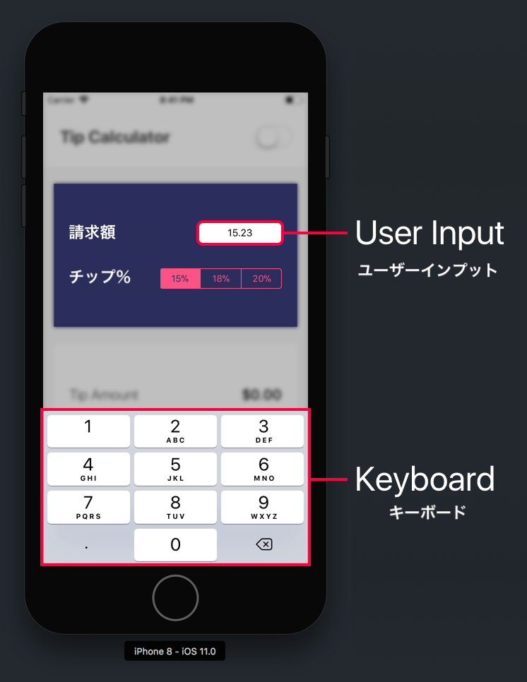
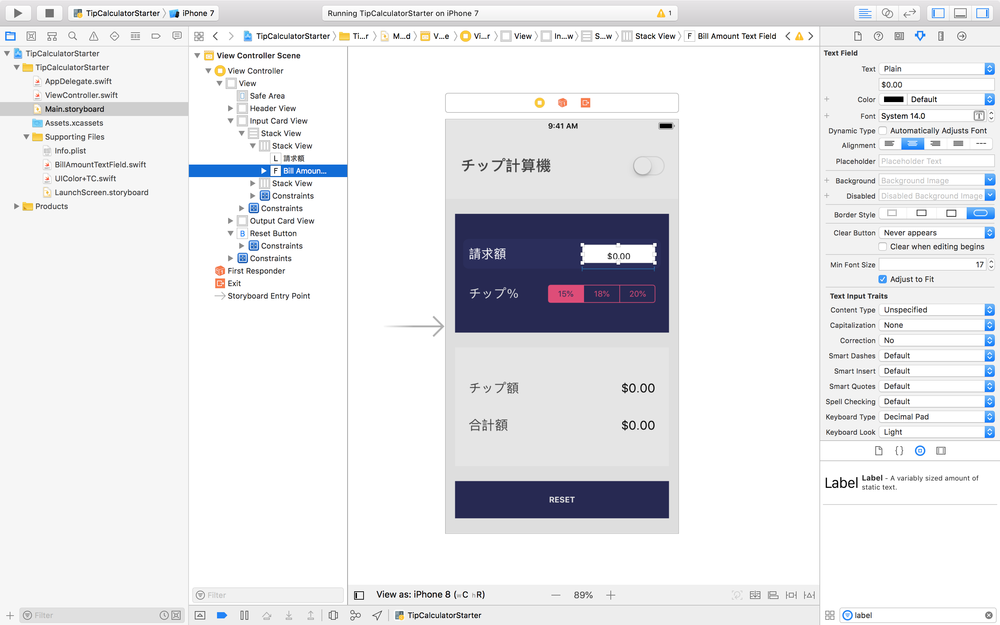
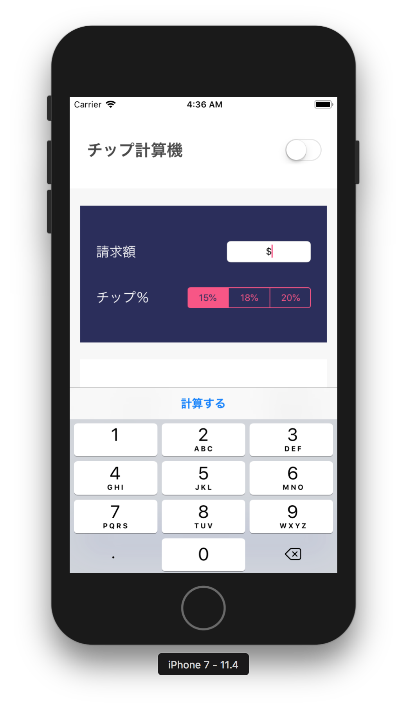
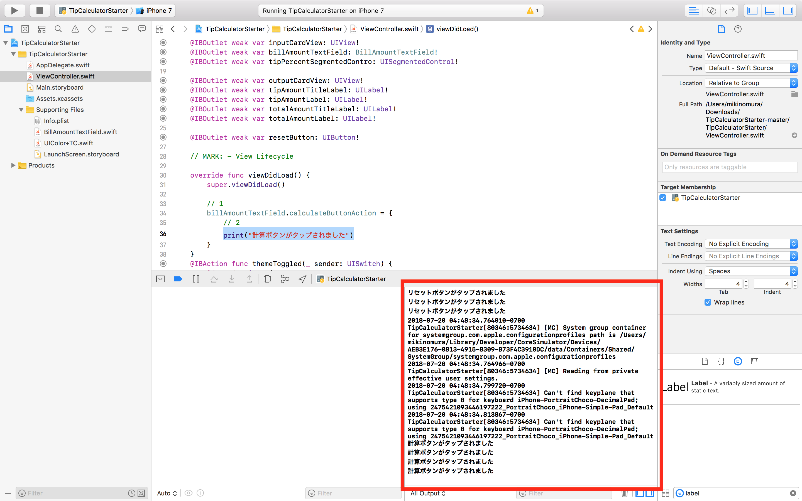
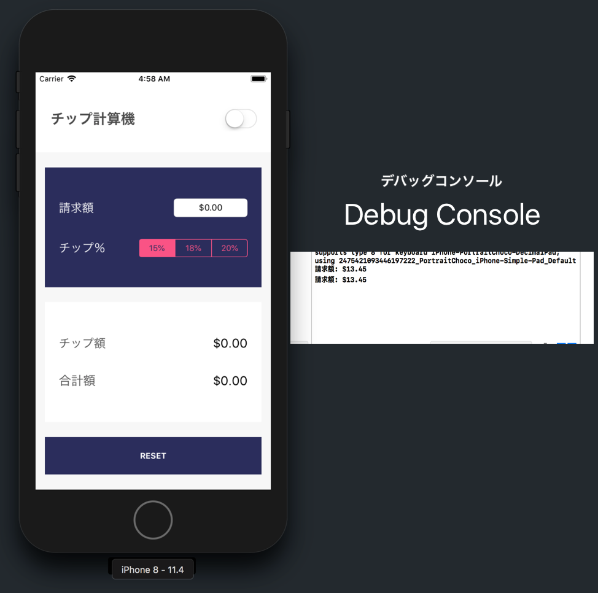
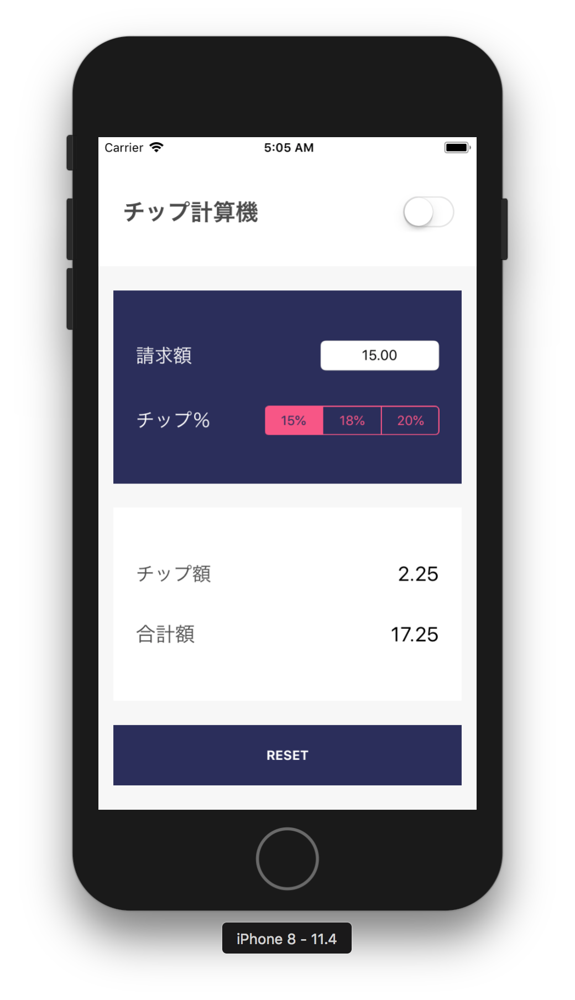

この時点で、チップ計算機のUIの作成を完了しました。でもアプリを起動しても何も起こりません。うーん。これでは役に立ちませんね。

1つ星の評価を付けられないようにするため、次のコードを書いてチップ計算機が機能するようにしましょう。

1. ユーザーの入力を取得
1. 正しい出力を計算
1. 出力データでUIを更新

まず、ユーザーが入力した元の請求額にアクセスする方法を考えましょう！

# 入力された請求額を読み出す

出力を計算するには、最初にユーザーに元の請求額を入力してもらう必要があります。



ユーザーが _Bill Amount_ のテキストフィールドをタップすると、ユーザーの入力用のテンキーが表示されます。ですが、請求額を入力した後にキーボードを消せません。

まずはこれを直しましょう。キーボードの右上に _Calculate_ ボタンを実装します。

> [info]
シンプルにするために、もうすぐ完成するcalculateボタンの背後でちょっとした魔法を使います。大部分は特製の`UITextField`サブクラスに抽象化しました。これは現在の`UITextField`に取って代わります。Calculateボタンがどうして表示されるのかを完全に理解していなくても、今のところは大丈夫です！

## 計算ボタンを追加する

> [action]
プロジェクトナビゲーターから`BillAmountTextField.swift`を開きます。次のように表示されます。
>


注意すべき最大の点は、`BillAmountTextField.swift`が`UITextField`のカスタム サブクラスだということです。カスタム テキストフィールドには _input accessory_ ビュー、すなわちキーボードのすぐ上に配置されるビューがあります。

このファイルのコードについては今の時点ではあまり心配しないで大丈夫です。簡単に言うと、 _Calculate_ ボタンを作成して、テキストフィールドの _input accessory_ ビューの中に配置します。すぐにわかります。

サブクラスを使用するには、現在の`UITextField`を`BillAmountTextField`サブクラスで置き換える必要があります。

> [action]
`Main.storyboard`を開いて`BillAmountTextField`を _Bill Amount_ テキストフィールドのカスタムクラスとして設定します。
>
1. _Document Outline_ を使って _Bill Amount_ テキストフィールドを選択します。
1. テキストフィールドを選択した状態でユーティリティエリアの _Identity Inspector_ を開きます。
1. _Identity Inspector_ で _Class_ フィールドを見つけて、`BillAmountTextField`に設定します。入力し始めると、オートコンプリートで探しているクラスが入力されます。うまく動作しないのならば、何かがおかしいということです！ 

次に、Swiftコードでテキストフィールドに対応する`IBOutlet`を更新する必要があります。

> [action]
`ViewController.swift`を開いてテキストフィールドの`IBOutlet`を見つけてください。`billAmountTextField`の型を`UITextField`から`BillAmountTextField`に更新します。
>
```
class ViewController: UIViewController {
>
    // ...
>
    @IBOutlet weak var billAmountTextField: BillAmountTextField!
>
    // ...
>
}
```

That's it! テキストフィールドをカスタム`UITextField`サブクラスに設定しました。変更をテストしましょう。

> [action]
プロジェクトをビルドして実行します。`billAmountTextField`をタップして選択します。キーボードが上にスライドして、次が表示されるはずです。
>


表示されましたか？ キーボードのすぐ上に、新しいCalculateボタンが表示されます!

## ボタンの動作を計算する

次に、 _Calculate_ ボタンがタップされたらコードを実行する方法を突き止める必要があります。

プロジェクトナビゲーターから`BillAmountTextField.swift`を開きます。

`calculateButtonAction`プロパティを探します。

```
class BillAmountTextField: UITextField {

    // ...

    var calculateButtonAction: (() -> Void)?

    // ...

}
```

`calculateButtonAction`は`(() -> Void)?`型のオプショナルのクロージャです。次に、`calculateButtonTapped(_:)`関数を探すと、 _Calculate_  ボタンがタップされるたびに`calculateButtonAction`が呼び出されるのが分かります。

```
class BillAmountTextField: UITextField {

    // ...

    @objc private func calculateButtonTapped(_ sender: UIBarButtonItem) {
        calculateButtonAction?()
    }
}
```

カスタム テキスト フィールドの`calculateButtonAction`プロパティを設定することで、 _Calculate_ ボタンがタップされるたびに実行されるクロージャを渡せます。

> [info]
頭をかきながら、どういう仕組みで _Calculate_  ボタンがタップされるたびに`calculateButtonTapped(_:)`が呼び出されるのだろうと不思議に思っているかもしれません。このチュートリアルでは詳しく掘り下げませんが、簡単に言うと、次のコード行で同等の`IBAction`をプログラムによりセットアップしました。
>
```
let calculateButton = UIBarButtonItem(title: "Calculate Tip", style: .done, target: self, action: #selector(calculateButtonTapped))
```

`calculateButtonAction`の設定に取り組んで、printステートメントを持つクロージャを実行できるようにしましょう。

> [action]
`ViewController.swift`を開きます。次のコードを`viewDidLoad`に追加します。
>
```
override func viewDidLoad() {
    super.viewDidLoad()
>
    // 1
    billAmountTextField.calculateButtonAction = {
        // 2
        print("calculate button tapped")
    }
}
```
>
ステップバイステップ：
>
1. `billAmountTextField`オブジェクトの`calculateButtonAction`変数を新しいクロージャに設定します。思い出してください。クロージャは無名関数です。
1. クロージャ内でクロージャが呼び出されたときに実行したいコードを設定できます。この場合、シンプルなprintステートメントを追加します。

<!-- break -->

> [info]
**`viewDidLoad`関数とその機能とは？**
>
`viewDidLoad`は多数あるビューコントローラーライフサイクル関数の1つです。これらの関数は`UIViewController`オブジェクトから継承されています。各ライフサイクル関数は、ビューコントローラーの画面上への表示・非表示など、重要なイベントを定義します。具体的には、`viewDidLoad`は、ビューコントローラーのビュー階層 (rootビューとそのサブビュー) がメモリに読み込まれると呼び出されます。
>
他の一般的なビュー コントローラーライフサイクル関数には次のようなものがあります。
>
```
func viewWillAppear(_ animated: Bool) // Called when the view is about to made visible. Default does nothing
>
func viewDidAppear(_ animated: Bool) // Called when the view has been fully transitioned onto the screen. Default does nothing
>
func viewWillDisappear(_ animated: Bool) // Called when the view is dismissed, covered or otherwise hidden. Default does nothing
>
func viewDidDisappear(_ animated: Bool) // Called after the view was dismissed, covered or otherwise hidden. Default does nothing
>
func viewDidLayoutSubviews() // Called just after the view controller's view's layoutSubviews method is invoked. Subclasses can implement as necessary. The default is a nop.
```
>
この場合では、ビューコントローラーのビューが読み込まれたら最初に実行したいセットアップコードを呼び出すにあたって、`viewDidLoad`は便利です。

`viewDidLoad`メソッドで設定したクロージャが、 _Calculate_ ボタンをタップすると呼び出されるか検証しましょう。

> [action]
プロジェクトをビルドして実行します。
>
1. `billAmountTextField`をタップして選択します。
1. キーボードの上の _Calculate_ ボタンをタップします。
>
_Calculate_ ボタンを数回タップしたら、デバッグ コンソールに表示されるprint ステートメントを確認します。
>


素晴らしい！ ここまでは、 _Calculate_ ボタンがタップされるたびにprint ステートメントがきちんと実行されています。最後に、 _Bill Amount_  テキストフィールドにユーザーが入力した請求額を出力するように、printステートメントを変更しましょう。

## テキストフィールドの入力部分にアクセスする

他のビューオブジェクトと同様、`UITextField`は多くのインスタンス変数と関数を持つクラスです。`BillAmountTextField`は`UITextField`のカスタムサブクラスなので、インスタンス関数と変数をすべて継承します。

```
open class UITextField : UIControl, UITextInput, NSCoding, UIContentSizeCategoryAdjusting {

    open var text: String?

    @available(iOS 6.0, *)
    @NSCopying open var attributedText: NSAttributedString?

    open var textColor: UIColor?

    open var font: UIFont?

    // ...
}
```

`UITextField`のクラス定義を見ると、テキストフィールド内のテキストにアクセスするのは`text`変数を読み取るのと同じぐらいシンプルだということが分かります。

試してみましょう！

> [action]> [action]
`viewDidLoad`のコードを次のように変更します。
>
```
override func viewDidLoad() {
    super.viewDidLoad()
>
    billAmountTextField.calculateButtonAction = {
        guard let billAmountText = self.billAmountTextField.text
            else { return }
>
        print("Bill Amount: \(billAmountText)")
    }
}
```
>
上記のコードでは、`guard`キーボードを使用して`text`はnil以外の値となるようにしていることに注目してください。`billAmountTextField`の`text`値が`nil`の場合は、`guard`ステートメントが処理を戻し、クロージャの残りのコードは実行されません。
>
もう一度コードをテストしましょう。
>
1. `billAmountTextField`をタップして選択します。
1. テンキーで請求額を入力します。
1. _Calculate_ ボタンをタップします。
1. デバッグコンソールに正しい請求額が出力されるのを確認します。
>


ご覧の通り、正しい請求額がデバッグコンソールに出力されます！

# チップの計算

ユーザーが入力した請求額を正しく読み取れたので、出力（チップ額 + 総額）を計算するロジックを実装します。

出力を計算するには、次を行う必要があります。

1. 請求額の入力値を`String`から`Double`に変更します。 _Bill Amount_ 値は小数点以下2桁に四捨五入されます。
1. 請求額にチップの割合を掛けてチップ額を計算します。チップ額も小数点以下2桁に四捨五入されます。
1. 請求額とチップ額を合計して総額を計算します。

最初に、請求額の入力値を`String`から`Double`に変換します。これは、Swiftに内蔵される型のイニシャライザを使用して実行できます。

さあ確認してみましょう。

> [action]
`ViewController.swift`を開いて、`viewDidLoad`を次のように変更します。
>
```
override func viewDidLoad() {
    super.viewDidLoad()
>
    billAmountTextField.calculateButtonAction = {
        // 1
        guard let billAmountText = self.billAmountTextField.text,
            let billAmount = Double(billAmountText) else {
                return
        }
>
        print("Bill Amount: \(billAmount)")
    }
}
```

ご覧の通り、Swiftには型を簡単に別の型に変換できる型のイニシャライザが用意されています。この場合、`Double(_:)`イニシャライザを使って`billAmountText`の値を`String`から`Double`に変換します。文字列がDoubleに変換できない無効な値の場合は、イニシャライザは処理に失敗し、nilを返します。

次に、値を小数点以下2桁に四捨五入して、入力された請求額をわかりやすくします。次のように`rounded()`関数を`Double`型に対して使用できます。

> [action]
請求額値を小数点以下2桁に四捨五入して、サニタイズします。
>
```
override func viewDidLoad() {
    super.viewDidLoad()
>
    billAmountTextField.calculateButtonAction = {
        // 1
        guard let billAmountText = self.billAmountTextField.text,
            let billAmount = Double(billAmountText) else {
                return
        }
>
        let roundedBillAmount = (100 * billAmount).rounded() / 100
>
        print("Bill Amount: \(roundedBillAmount)")
    }
}
```

正しくフォーマットされた請求額を使って、チップ額を計算できます。まず最初に、チップの割合は15%としましょう。チップ額も小数点以下2桁に四捨五入して、サニタイズしましょう。

> [info]
将来的には、セグメンテッドコントロールを使用して、ユーザーが動的なチップの割合を選択できるようにします。

<!-- break -->

> [action]
チップ額を計算してサニタイズします。
>
```
override func viewDidLoad() {
    super.viewDidLoad()
>
    billAmountTextField.calculateButtonAction = {
        // 1
        guard let billAmountText = self.billAmountTextField.text,
            let billAmount = Double(billAmountText) else {
                return
        }
>
        let roundedBillAmount = (100 * billAmount).rounded() / 100
>
        // 2
        let tipPercent = 0.15
        let tipAmount = roundedBillAmount * tipPercent
        let roundedTipAmount = (100 * tipAmount).rounded() / 100
>
        print("Bill Amount: \(roundedBillAmount)")
        print("Tip Amount: \(roundedTipAmount)")
    }
}
```

ロジックを完成させるために、チップと請求額を合計して総額を計算します。

> [action]
総額を計算します。
>
```
override func viewDidLoad() {
    super.viewDidLoad()
>
    billAmountTextField.calculateButtonAction = {
        // 1
        guard let billAmountText = self.billAmountTextField.text,
            let billAmount = Double(billAmountText) else {
                return
        }
>
        let roundedBillAmount = (100 * billAmount).rounded() / 100
>
        // 2
        let tipPercent = 0.15
        let tipAmount = roundedBillAmount * tipPercent
        let roundedTipAmount = (100 * tipAmount).rounded() / 100
>
        // 3
        let totalAmount = roundedBillAmount + roundedTipAmount
>
        print("Bill Amount: \(roundedBillAmount)")
        print("Tip Amount: \(roundedTipAmount)")
        print("Total Amount: \(totalAmount)")
    }
}
```

ロジックをテストして、想定通り動作するか確かめましょう。

> [action]
プロジェクトをビルドして実行します。いくつか値を検証して、デバッグ コンソールのprintステートメントが正しいことを確認しましょう。
>


# 出力カードの設定

計算した出力値でUIを更新する必要があります。ですが、まずはテンキーを消して、出力カードが見えるようにしましょう。

> [action]
`ViewController.swift`で、次のコード行を`viewDidLoad`に追加します。
>
```
billAmountTextField.calculateButtonAction = {
    // 表示されているならキーボードを片付けます
    if self.billAmountTextField.isFirstResponder {
        self.billAmountTextField.resignFirstResponder()
    }
>
    // ...
}
```

再びプロジェクトをビルドして実行します。 _Calculate_ ボタンをタップするとテンキーが消えます。

出力カードが見えるようになったので、UIの更新に取り組みましょう。

`UILabel`クラス定義を見ると次のようになっています。

```
class UILabel : UIView, NSCoding, UIContentSizeCategoryAdjusting {

    var text: String?

    var font: UIFont!

    var textColor: UIColor!

    // ...

}
```

`UILabel`が表示するテキストを更新するには、各`UILabel`の`text`プロパティを使用できます。`calculateButtonAction`が出力カードのチップ額と送金額のラベルを設定するよう、クロージャを更新しましょう。

> [action]
`ViewController.swift`でコードを更新して、出力カードのラベルを更新します。
>
```
override func viewDidLoad() {
    super.viewDidLoad()
>
    billAmountTextField.calculateButtonAction = {
        // 表示されているならキーボードを片付けます
        if self.billAmountTextField.isFirstResponder {
            self.billAmountTextField.resignFirstResponder()
        }
>
        guard let billAmountText = self.billAmountTextField.text,
            let billAmount = Double(billAmountText) else {
                return
        }
>
        let roundedBillAmount = (100 * billAmount).rounded() / 100
>
        let tipPercent = 0.15
        let tipAmount = roundedBillAmount * tipPercent
        let roundedTipAmount = (100 * tipAmount).rounded() / 100
>
        let totalAmount = roundedBillAmount + roundedTipAmount
>
        // UI を更新する
        self.billAmountTextField.text = String(format: "%.2f", roundedBillAmount)
        self.tipAmountLabel.text = String(format: "%.2f", roundedTipAmount)
        self.totalAmountLabel.text = String(format: "%.2f", totalAmount)
    }
}
```
>
たった今追加したコードは、対応する各ラベルの`text`プロパティにフォーマットされた文字列を設定して、UIを更新します。
>
プロジェクトをビルドして実行します。支払額を入力して _Calculate_ ボタンをタップします。正しく機能すれば、チップ額と請求額が出力カードに表示されます！
>


# 計算ロジックをリファクタリング

次に進む前に、現在のコードの一部をリファクタリングしましょう。今のところ、チップと支払額の計算ロジックの大半は`calculateButtonAction`クロージャにあります。

ロジックを関数に移して、再利用できるようにしましょう。

> [action]
`ViewController.swift`でチップ計算用の新しい関数を作成します。
>
```
func calculate() {
    // キーボードを片付けます
    if self.billAmountTextField.isFirstResponder {
        self.billAmountTextField.resignFirstResponder()
    }
>
    guard let billAmountText = self.billAmountTextField.text,
        let billAmount = Double(billAmountText) else {
            return
    }
>
    let roundedBillAmount = (100 * billAmount).rounded() / 100
>
    let tipPercent = 0.15
    let tipAmount = roundedBillAmount * tipPercent
    let roundedTipAmount = (100 * tipAmount).rounded() / 100
>
    let totalAmount = roundedBillAmount + roundedTipAmount
>
    // UI を更新する
    self.billAmountTextField.text = String(format: "%.2f", roundedBillAmount)
    self.tipAmountLabel.text = String(format: "%.2f", roundedTipAmount)
    self.totalAmountLabel.text = String(format: "%.2f", totalAmount)
}
```

次に、`calculateButtonAction`クロージャを変更して、`calculate`メソッドを使用するようにします。

> [action]
`ViewController.swift`で`viewDidLoad`を次のように変更します。
>
```
override func viewDidLoad() {
    super.viewDidLoad()
>
    billAmountTextField.calculateButtonAction = {
        self.calculate()
    }
}
```

ロジックを独自の関数に移動できました。これは`UISegmentedControl`を実装するのに役立ちます。

# チップのパーセントの設定

チップを計算するとUIが正しく更新されます。次に、`UISegmentedControl`に戻ってその実装に取り組みましょう。

現在ビュー コントローラーには、ユーザーが`UISegmentedControl`の新しいセグメントを選択するたびにトリガされる`IBAction`が格納されています。この`IBAction`がトリガされると、新しく選択されたチップの割合を使ってチップを再計算します。

最初に、あるセグメントが選択されるとチップを計算するように`IBAction`を更新しましょう。

> [action]
`ViewController.swift`で`tipPercentChanged(_:)`を次のように更新します。
>
```
@IBAction func tipPercentChanged(_ sender: UISegmentedControl) {
    calculate()
}
```

次に、calculate 関数を更新して、`UISegmentedControl`の正しいチップの割合を使用するようにします。

> [action]
`ViewController.swift`で`calculate()`関数を次のように変更します。
>
```
func calculate() {
    // キーボードを片付けます
    if self.billAmountTextField.isFirstResponder {
        self.billAmountTextField.resignFirstResponder()
    }
>
    guard let billAmountText = self.billAmountTextField.text,
        let billAmount = Double(billAmountText) else {
            return
    }
>
    let roundedBillAmount = (100 * billAmount).rounded() / 100
>
    let tipPercent: Double
    switch tipPercentSegmentedControl.selectedSegmentIndex {
    case 0:
        tipPercent = 0.15
    case 1:
        tipPercent = 0.18
    case 2:
        tipPercent = 0.20
    default:
        preconditionFailure("Unexpected index.")
    }
>
    let tipAmount = roundedBillAmount * tipPercent
    let roundedTipAmount = (100 * tipAmount).rounded() / 100
>
    let totalAmount = roundedBillAmount + roundedTipAmount
>
    // UI を更新する
    self.billAmountTextField.text = String(format: "%.2f", roundedBillAmount)
    self.tipAmountLabel.text = String(format: "%.2f", roundedTipAmount)
    self.totalAmountLabel.text = String(format: "%.2f", totalAmount)
}
```
>
上記のコードでは、セグメンテッドコントロールの`selectedSegmentIndex`と`switch`ステートメントを使用してチップの正しい割合を求めます。`tipPercent`を使用してチップを正しく計算します。

新たな変更をテストしましょう！

> [action]
プロジェクトをビルドして実行します。請求額とチップの割合を変えて、出力カードが正しく更新されることを確認しましょう。

# リセットボタン

ロジックの仕上げとしてリセット機能を実装しましょう。

`calculate`ロジックと同様に、リセットのロジックを独自の関数に分割しましょう。

リセットロジックでは、チップ計算機を初期状態にリセットします。次のタスクを忘れずに実行しましょう。

- テキストフィールドの`text`値を`nil`に設定
- セグメンテッドコントロールの`selectedSegmentIndex`を`0`に設定
- 出力カードの両方の出力ラベルを`$0.00`に戻す

> [challenge]
上のロジックを`clear()`という関数に実装してみましょう。

<!-- break -->

> [solution]
新しい`clear()`関数は次のようになります。
>
```
func clear() {
    billAmountTextField.text = nil
    tipPercentSegmentedControl.selectedSegmentIndex = 0
    tipAmountLabel.text = "$0.00"
    totalAmountLabel.text = "$0.00"
}
```

次に、リセット ボタンの`IBAction`を更新する必要があります。

> [action]
`ViewController.swift`で、次のように`resetButtonTapped(_:)`メソッドを更新します。
>
```
@IBAction func resetButtonTapped(_ sender: UIButton) {
    clear()
}
```

最後に、`calculate`が無効な入力を取得したら、計算ツールの状態もリセットしましょう。

> [action]
`calculate()`を次のように変更します。
>
```
func calculate() {
    // キーボードを片付けます
    if self.billAmountTextField.isFirstResponder {
        self.billAmountTextField.resignFirstResponder()
    }
>
    guard let billAmountText = self.billAmountTextField.text,
        let billAmount = Double(billAmountText) else {
            clear()
            return
    }
>
    // ...
>
}
```

# 結論

うまく行きました！ このセクションでは、UIとIBコネクションを使ってチップ計算機のロジックを実装しました。

最初に、ユーザーの入力を _Bill Amount_ テキストフィールドから取得しました。次に、ユーザーの入力を使ってチップと合計金額を計算しました。仕上げに、出力カードに各ラベルを設定して、UIを更新しました。

次のセクションでは、チップ計算機の残りのスタイリングと機能を仕上げます！
