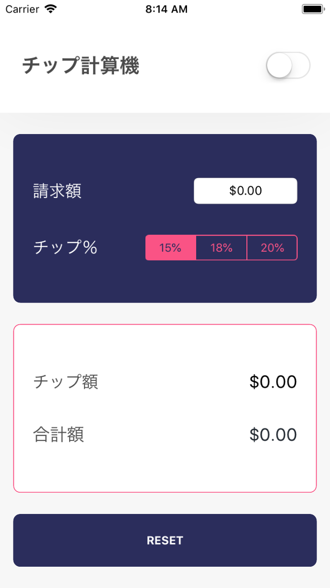

チップ計算機を完成させるには、スタイルを仕上げて、明るいテーマ/暗いテーマを切り替えるスイッチを実装する必要があります。

アプリのここまでの出来栄えを見てみましょう。


次に、デザインについて見てみましょう。



違いはわずかですが、UIを完成させるには次を追加する必要があります。

- ヘッダービューの影
- 入力カードの丸い角
- 出力カードの丸い角
- リセットボタンの丸い角
- 出力カードの枠線

これらの変更を加えていきましょう！

# レイヤーの構成

最終的なUIの変更を加えるには、`CALayer`について学ぶ必要があります。

各`UIView`オブジェクトには`CALayer`型の`layer`プロパティがあります。ビューのレイヤーは低水準APIで、開発者はビューのレンダリングを制御できます。

各ビューの`layer`プロパティを使用すると、簡単に影を付け、角を丸くし、枠線を表示できます。

ビューのレイヤーを構成していく前に、まずは新しい空のメソッドをビューコントローラーに作成しましょう。

> [action]
`ViewController.swift`に次の関数を追加してください。
>
```
func setupViews() {
    // まだ何もありません
}
```

このメソッドを使って各ビューのレイヤーを初期構成するコードを追加します。

レイヤーのカスタマイズをすべて最初に実行するように、この関数はビュー コントローラーのライフサイクルの最初に呼び出す必要があります。

> [action]
`ViewController.swift`で`viewDidLoad()`の`setupViews()`を呼び出します。
>
```
override func viewDidLoad() {
    super.viewDidLoad()
>
    setupViews()
>
    billAmountTextField.calculateButtonAction = {
        self.calculate()
    }
}
```

`setupViews()`メソッドでヘッダービュー下部に影を追加するコードを追加できます。

> [action]
ヘッダービューのレイヤーを構成して影を追加します。
>
```
func setupViews() {
    headerView.layer.shadowOffset = CGSize(width: 0, height: 1)
    headerView.layer.shadowOpacity = 0.05
    headerView.layer.shadowColor = UIColor.black.cgColor
    headerView.layer.shadowRadius = 35
}}
```
>
`CALayer`にはビューの外観を構成できる属性がたくさんあります。上記のコードにヘッダービューの薄い影を作成するコードを追加します。
>
プロジェクトをビルドして実行します。影がヘッダービューの下に表示されます。
>


<!-- break -->

> [info]
UIの影は薄くてよく見えません。コードが正しく機能することを検証したい場合は、レイヤーの`shadowOpacity`を`1`に近い値に調整できます。検証が済んだら値を戻すことを忘れずに。

次に、ビューのレイヤーを設定して、丸みのある角にします。

## 丸みのある角部

影の設定と同様に、各`CALayer`には`cornerRadius`プロパティがあります。これを調整してビューの角を丸くすることができます。

入力カードの角を丸くするコードを追加しましょう。

> [action]
入力カードに丸い角を追加します。
>
```
func setupViews() {
    headerView.layer.shadowOffset = CGSize(width: 0, height: 1)
    headerView.layer.shadowOpacity = 0.05
    headerView.layer.shadowColor = UIColor.black.cgColor
    headerView.layer.shadowRadius = 35
>
    inputCardView.layer.cornerRadius = 8
    inputCardView.layer.masksToBounds = true
}
```
>
レイヤーの`maskToBounds`プロパティを`true`に設定したことも重要です。これによってビューの内容が丸い角の外に表示されるのを防ぎます。

コードがちゃんと機能するかテストしましょう！

> [action]
UIの更新をビルドして実行します。
>


簡単ですね！ 自分で練習してみてください。

> [challenge]
丸い角 (上と同じ角の半径) を`outputCardView`と`resetButton`の両方に追加します。

<!-- break -->

> [solution]
両方のビューに丸い角を追加するには、下のコードに`setupViews()`メソッドを追加します。
>
```
func setupViews() {
>
    // ...
>
    outputCardView.layer.cornerRadius = 8
    outputCardView.layer.masksToBounds = true
>
    resetButton.layer.cornerRadius = 8
    resetButton.layer.masksToBounds = true
}
```

## 境界線

UIの変更を完了するには、出力カードに枠線を追加します。繰り返しますが、`CALayer`には2つのプロパティがあります。`borderWidth`と`borderColor`でレイヤーの枠線を設定できます。驚くことはありませんね。

> [action]
次のコードを`setupViews()`に追加します。
>
```
func setupViews() {
>
    // ...
>
    outputCardView.layer.cornerRadius = 8
    outputCardView.layer.masksToBounds = true
>
    // 出力カードの境界線を設定
    outputCardView.layer.borderWidth = 1
    outputCardView.layer.borderColor = UIColor.tcHotPink.cgColor
>
    resetButton.layer.cornerRadius = 8
    resetButton.layer.masksToBounds = true
}
```

チップ計算機のサブビューのスタイリングが完了しました。チップ計算機は次のような外観になります。


# ライト / ダークテーマ

<<<<<<< HEAD
実装する必要がある最後の機能はテーマの切り替えです。現在のアプリは明るい色のテーマになっています。実装が完了すると、`UISwitch`が明るい色のテーマと暗い色のテーマを切り替えられるようになります。
=======
The last feature we need to implement is the ability to toggle themes. Currently, our app has a light colored theme. When we're finished, our `UISwitch` will be able to toggle from our light colored theme to a dark one (and vice versa).
>>>>>>> cbcfbeaf301c91d7970277fdcd0642ed9be265c9

まず、テーマを切り替えるコードを記述する新しい関数を作成しましょう。

> [action]
`ViewController.swift`に次の新しいメソッドを追加します。
>
```
func setTheme(isDark: Bool) {
>
}
```

次に、各テーマの色情報を格納する新しいデータ構造を作成します。作成が終わったら、このオブジェクトを使ってテーマを切り替えられるようになります。

> [action]
新しい`ColorTheme`構造体を作成します。
>
1. CMD-Nを押してプロジェクトに新しいファイルを作成します。
1. _Swift File_ を選択して _Next_ をクリックします。
1. 新しいSwiftファイルに`ColorTheme.swift`という名前を付けて _Create_ をクリックします。
>
終わったら、`ColorTheme.swift`という名前の新しいSwiftソース ファイルが表示されるはずです。
>


新しいソース ファイルを使って`ColorTheme`データ構造を作成できます。

> [action]
`ColorTheme.swift`に次のコードを追加します。
>
```
import UIKit
>
struct ColorTheme {
>
    // MARK: - インスタンス変数
>
    let isDefaultStatusBar: Bool
    let viewControllerBackgroundColor: UIColor
>
    let primaryColor: UIColor
    let primaryTextColor: UIColor
>
    let secondaryColor: UIColor
>
    let accentColor: UIColor
    let outputTextColor: UIColor
}
```
>
各テーマのデータを格納する新しい「構造体」を作成します。`ColorTheme`の各プロパティはチップ計算機のUIの対応するビューの色を設定します。

`ColorTheme`構造体を使用して、明るい色のテーマと暗い色のテーマを作成できます。これにはクラス変数を使います。

> [action]
`ColorTheme.swift`で新しいクラス変数を2つ作成してください。
>
```
struct ColorTheme {
>
    // MARK: - クラス変数
>
    static let light = ColorTheme(isDefaultStatusBar: true,
                                  viewControllerBackgroundColor: .tcOffWhite,
                                  primaryColor: .tcWhite,
                                  primaryTextColor: .tcCharcoal,
                                  secondaryColor: .tcDarkBlue,
                                  accentColor: .tcHotPink,
                                  outputTextColor: .tcAlmostBlack)
>
    static let dark = ColorTheme(isDefaultStatusBar: false,
                                 viewControllerBackgroundColor: .tcAlmostBlack,
                                 primaryColor: .tcMediumBlack,
                                 primaryTextColor: .tcWhite,
                                 secondaryColor: .tcBlueBlack,
                                 accentColor: .tcSeafoamGreen,
                                 outputTextColor: .tcWhite)
>
    // ...
>
}
```

作成したクラス変数のデータを使ってチップ計算機の現在の色のテーマを変更できます。

> [action]
`ViewController.swift`で`setTheme(isDark:)`を更新し、有効になっているテーマに応じて、チップ計算機の色を変更するようにします。
>
```
func setTheme(isDark: Bool) {
    let theme = isDark ? ColorTheme.dark : ColorTheme.light
>
    view.backgroundColor = theme.viewControllerBackgroundColor
>
    headerView.backgroundColor = theme.primaryColor
    titleLabel.textColor = theme.primaryTextColor
>
    inputCardView.backgroundColor = theme.secondaryColor
>
    billAmountTextField.tintColor = theme.accentColor
    tipPercentSegmentedControl.tintColor = theme.accentColor
>
    outputCardView.backgroundColor = theme.primaryColor
    outputCardView.layer.borderColor = theme.accentColor.cgColor
>
    tipAmountTitleLabel.textColor = theme.primaryTextColor
    totalAmountTitleLabel.textColor = theme.primaryTextColor
>
    tipAmountLabel.textColor = theme.outputTextColor
    totalAmountLabel.textColor = theme.outputTextColor
>
    resetButton.backgroundColor = theme.secondaryColor
}
```

さらに、ステータスバーの色が正しく更新されるようにコードを追加する必要があります。

> [action]
`ViewController.swift`で次のプロパティをクラスの一番上に追加します。
>
```
class ViewController: UIViewController {
>
    // MARK: - プロパティ
>
    // 1
    var isDefaultStatusBar = true
>
    // 2
    override var preferredStatusBarStyle: UIStatusBarStyle {
        return isDefaultStatusBar ? .default : .lightContent
    }
>
    // ...
>
}
```
>
追加した新しいプロパティについて説明します。
>
1. `isDefaultStatusBar`は、既定または明るい色のステータスバーのどちらを表示するかを表す`Bool`を保持します。既定の場合はステータスバーの色は黒になります。
1. `preferredStatusBarStyle`プロパティをオーバーライドして、`isDefaultStatusBar`を使い、ビューコントローラーのステータスバーのスタイルを設定します。
>
「ステータスバーのスタイルを設定するのになぜ2つのプロパティが必要なんだ？」と思うかもしれません。良い質問です。`preferredStatusBarStyle`プロパティはスーパークラスが継承されているため直接設定できません。このため、どのステータスバーのスタイル`preferredStatusBarStyle`を表示すべきかを保存する`isDefaultStatusBar`変数が必要です。

<!-- break -->

テーマがトグルされたときにステータスバーが更新されるようにするには、次のコードを`setTheme(isDark:)`メソッドに追加する必要があります。

> [action]
`ViewController.swift`の`setTheme(isDark:)`を更新します。
>
```
func setTheme(isDark: Bool) {
>
    // ...
>
    isDefaultStatusBar = theme.isDefaultStatusBar
    setNeedsStatusBarAppearanceUpdate()
}
```

## IBActionの実装

`UISwitch`をトグルするたびにテーマを切り替えるには、`setTheme(isDark:)`を`themeToggled(_:)`メソッドに接続する必要があります。

> [action]
`themeToggled(_:)`の`setTheme(isDark:)`を呼び出します。
>
```
@IBAction func themeToggled(_ sender: UISwitch) {
    setTheme(isDark: sender.isOn)
}
```
>
テーマは`UISwitch`がトグルされるたびに明るい色から暗い色に切り替わります。その逆も同様です。スイッチの`isOn`プロパティに応じてテーマが設定されます。

## 初回テーマ設定

チップ計算機の最初のテーマの状態を設定して、きれいにする必要があります。`setTheme(isDark:)`をビューコントローラーライフサイクルの最初に呼び出すことで、これを実行できます。

> [action]
`ViewController.swift`でビューコントローラーを次のように変更します。
>
```
override func viewDidLoad() {
    super.viewDidLoad()
>
    setupViews()
    setTheme(isDark: false)
>
    billAmountTextField.calculateButtonAction = {
        self.calculate()
    }
}
```
>
`setTheme(isDark: false)`を呼び出して、ビューコントローラーのビューがセットアップされたらテーマが初期設定されるようにします。

正しく機能するかコードをテストしましょう！

> [action]
プロジェクトをビルドして実行します。`UISwitch`をトグルして、明るい色のテーマと暗い色のテーマを切り替えます。すべてうまく行けば、チップ計算機を暗いモードで使用できるはずです！ どちらのテーマがお好みですか？
>


テーマ機能を実装したら、チップ計算機の機能とデザインが完成です！ 次のセクションでは、学んだ内容を確認し、課題に取り組んで新しいスキルを練習します。
