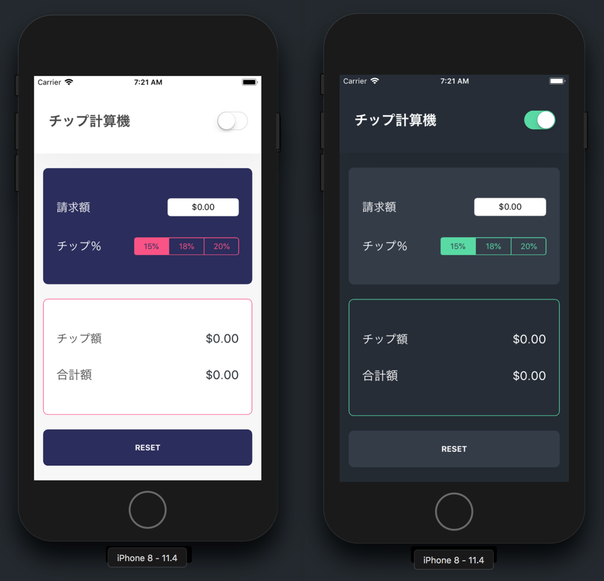

よくできました! 2つ目のiOSチュートリアルを修了しました。

その過程でいくつかの新しいスキルを学びました。

- デザインをビューに視覚的に分けていく方法
- UIKitのビューコンポーネントを識別し、使用する方法
- Auto Layout、制約、スタックビューでUIレイアウトを作成する方法
- プログラミングを通じてクラスプロパティを取得・設定する方法

また、基本を復習しました。

- プロジェクトナビゲーターを使ってXcodeファイルを移動
- アシスタントエディタを使用してファイルを並べて表示
- `IBOutlet`接続と`IBAction`接続を _Interface Builder_ で作成

新しいアプリを作成しました。あなたは、すばらしいiOS開発者になる道を着々と進んでいます。

ここで少し休憩して、今までの道のりを振り返って祝いましょう！

# チャレンジが近づく

まだ終わりではありません。いい気分に浸って楽しんだら、スキルを試す番です。

## 課題

別の国の出身あるいは旅が大好きな人なら、チップの風習がない国は多くあることを知っているはず。そうした国ではチップ計算機は大して役に立ちません。

なので、海外旅行をするときに便利な通貨両替計算ツールを作成します。通貨両替計算アプリを構築するために、このチュートリアルで学んだスキルと概念を活用します。

いつものように、できるだけ自力でこの課題を達成しましょう。行き詰まった場合は、いつでもこのチュートリアルを見なおしてください！

## アプリのデザイン

上はデザイン例です。これを使って通貨両替計算を作成しましょう。この例はApp Storeで [人気の通貨換算ツール](https://itunes.apple.com/us/app/currency-converter/id628148586?mt=8) を元にしています。自由に創造性を発揮して、自分のスタイルをアプリのデザインに加えてください。

## 仕様

チップ計算機と同様に、通貨両替計算ツールアプリはユーザーの入力を読み取って別の値に変換します。

アプリに米ドルを入力するとすぐに、選択した通貨へ換算します。広く利用されている通貨にはユーロ、円、ルピー、ビットコインなどがあります。

上のデザインにはテキストフィールドもセグメンテッドコントローラーもないことに気づきましたか。各数字はボタンで、通貨換算ツールの入力と出力を変更します。

このアプリのしくみをもっとよく知りたい場合は、App Storeでこの[人気の通貨換算ツール] の無料版をダウンロードしてください (https://itunes.apple.com/us/app/currency-converter/id628148586?mt=8)。このアプリをダウンロードするのに何も購入する必要は**ありません**。

> [info]
為替の計算では、両替レートをオンラインで見つけて、アプリにハードコーディングします。

チャレンジの幸運を祈ります！ 行き詰まったらチュートリアルを見返したり、過去のコードを見直したりできるのをお忘れなく。
